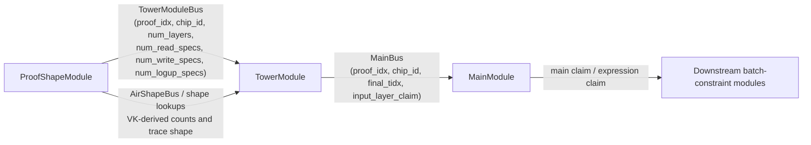
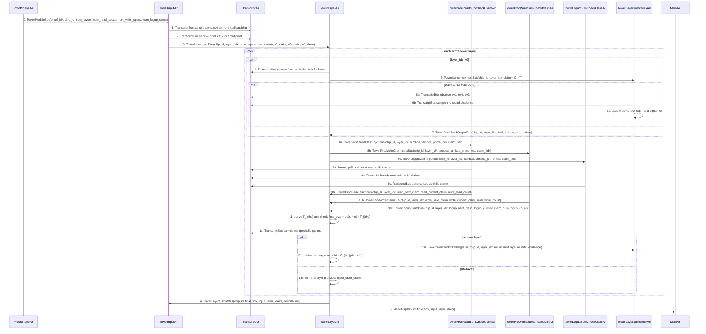

# Tower Module Design Notes

This document records the intended module boundaries for the recursive tower verifier. The lower-level AIR constraints
are specified in `tower_air_spec.md`; this file focuses on how the tower module should interact with the rest of the
recursive verifier circuit.

The tower module is verifier code. Its primary job is to verify every chip tower proof in every Ceno proof being
recursively verified: for each `(proof_idx, chip_id)`, it replays the native Ceno tower verifier for that chip's tower
proof. Transcript order, shape metadata, batching challenges, and exported claims must stay in lockstep with
`ceno_zkvm::scheme::verifier::TowerVerify`.

## Scope

The tower module reduces each `(proof_idx, chip_id)` tower proof to an input-layer claim. It does not own downstream
batch-constraint semantics; the next module checks what that reduced claim means. The interaction contract is captured by
the AIR sequence diagram and the per-AIR contracts below.

The target readers are both human developers and AI agents. Prefer explicit message contracts, algebraic meanings, and
ordering rules over implicit references to current Rust struct names; the doc should be usable as a debugging guide and
as implementation context.

## Names And Scopes

Use these names consistently in diagrams, contracts, and AIR specs.

| Name | Meaning | Scope / Owner |
|------|---------|---------------|
| `proof_idx` | Logical index of the Ceno proof being recursively verified. | Scopes all per-proof buses; may be represented by the typed bus key instead of a payload field. |
| `chip_id` | VK-assigned unique id for one chip. | Selected by proof-shape; together with `proof_idx`, uniquely identifies one tower proof. |
| `layer_idx` | Active tower layer currently being reduced. | Local to one `(proof_idx, chip_id)` tower proof. |
| `tidx` | Transcript cursor at which an observe/sample event occurs. | Per proof; tower AIRs must match the native verifier transcript order. |
| `num_layers` | Number of active tower layers for this chip tower proof. | VK/proof-shape metadata consumed by `TowerInputAir` and `TowerLayerAir`. |
| `num_read_specs` | Number of read product specs for this chip. | VK-derived; forwarded to read product claim folding. |
| `num_write_specs` | Number of write product specs for this chip. | VK-derived; forwarded to write product claim folding. |
| `num_logup_specs` | Number of LogUp specs for this chip. | VK-derived; forwarded to LogUp claim folding. |
| `num_prod_specs` | `num_read_specs + num_write_specs`. | Derived from VK metadata; controls product batching width. |
| `alpha` / `lambda` | Batching challenge for product and LogUp specs. The math spec uses `alpha`; current layer AIRs often use `lambda` for the active challenge. | Fresh per layer; powers are reused across specs only within that layer. |
| `lambda_prime` | Previous layer batching challenge used by claim AIRs for the companion/current claim path. Root layer pins it to one. | Propagated by `TowerLayerAir`. |
| `rho` | Sumcheck evaluation point produced by the layer sumcheck rounds. | Produced by `TowerLayerSumcheckAir` for one layer. |
| `r_i` | Current layer point in the expected claim `C_i(r_i)`. | Carried by `TowerLayerAir` from one layer to the next. |
| `mu` | Merge/interpolation challenge for deriving the next layer point and expected claim. | Sampled by `TowerLayerAir`; used as the next layer's first challenge when another layer remains. |
| `T_i(rho)` | Current-layer expression computed from child claims at `rho`. | Derived by `TowerLayerAir` from read/write/LogUp `current_claim` outputs. |
| `C_{i+1}(rho, mu)` | Next layer's expected batched claim after interpolation at `mu`. | Derived by `TowerLayerAir` from read/write/LogUp `next_claim` outputs when another layer remains. |
| `current_claim` | A claim AIR's contribution to `T_i(rho)`. | Emitted by product/LogUp claim AIRs; corresponds to current Rust `lambda_prime_claim`. |
| `next_claim` | A claim AIR's contribution to `C_{i+1}(rho, mu)`. | Emitted by product/LogUp claim AIRs; corresponds to current Rust `lambda_claim`. |
| `input_layer_claim` | Final reduced claim after the terminal/input layer. | Emitted by tower to `MainBus`; downstream modules interpret its constraint meaning. |

## Module Interaction Diagram

The diagram below is the high-level circuit contract. It shows which modules own shape, tower verification, and
downstream claim checking for each `(proof_idx, chip_id)` tower proof.



Boundary rules:

- `ProofShapeModule` is the source of VK-derived tower shape metadata.
- `TowerModule` verifies the tower proof and emits reduced claims; it does not interpret downstream constraint
  semantics.
- `MainModule` and downstream modules check the reduced claim against the rest of the recursive verifier statement.

## External Module Boundaries

### Proof Shape Module

There is one native tower proof per chip per Ceno proof. The proof-shape side owns the VK-derived shape metadata for each
`(proof_idx, chip_id)` pair and starts each tower verification by sending `TowerModuleMessage`:

```text
(
  proof_idx,
  chip_id,
  num_layers,
  num_read_specs,
  num_write_specs,
  num_logup_specs
)
```

where:

- `proof_idx` scopes the Ceno proof being recursively verified. In the current typed per-proof bus implementation this
  may be the bus key rather than a field inside the message payload;
- `chip_id` is the VK-assigned unique id for this chip, selected by proof-shape;
- `num_layers` is the number of active tower layers for this chip's tower proof in this Ceno proof;
- `num_read_specs`, `num_write_specs`, and `num_logup_specs` are selected from the chip VK.

The proof-shape-to-tower message is shape metadata only. It should not carry transcript cursor state such as
`tower_tidx`; transcript scheduling belongs to the transcript/tower transcript contract. It also should not introduce a
separate tower row identity: `(proof_idx, chip_id)` uniquely identifies the tower proof.

For the selected chip VK, proof-shape derives:

```text
num_read_specs  = num_read_count
num_write_specs = num_write_count
num_logup_specs = num_logup_count
num_prod_specs  = num_read_specs + num_write_specs
```

These are extracted from the child VK constraint system, not from the proof. Tower uses them as the trusted shape for
the corresponding chip tower proof:

- `tower_proof.prod_specs_eval.len() == num_prod_specs`;
- `tower_proof.logup_specs_eval.len() == num_logup_specs`;
- initial and per-layer batching use `num_prod_specs + 2 * num_logup_specs` powers of `alpha`;
- read/write/LogUp claim AIRs use `num_read_specs`, `num_write_specs`, and `num_logup_specs` when folding child claims.

Tower also relies on proof-shape/metadata checks for:

- number of product specs;
- number of LogUp specs;
- number of active layers;
- per-layer read/write/LogUp accumulator counts;
- active evaluation-row counts for each spec;
- trace heights and padding rules for tower AIRs.

Shape metadata is security relevant. If the recursive verifier accepts a different active-round schedule or different
product/LogUp spec counts than the native verifier, it can verify a different tower statement.

Current implementation note: `TowerModuleMessage` only carries `(idx, tidx, n_logup)`, is sent from the proof-shape
summary row, and the tower input trace is still collapsed to one record per proof. The intended design is one
`TowerModuleBus` shape message and one tower input record per `(proof_idx, chip_id)`, carrying
`(proof_idx, chip_id, num_layers, num_read_specs, num_write_specs, num_logup_specs)`.

### Main / Downstream Claim Module

`TowerInputAir` emits the reduced tower claim through `MainBus`, keyed by `proof_idx`:

```text
MainMessage { chip_id, tidx, claim }
```

This claim is the tower output after all active layers have been reduced to the input layer. The downstream main/batch
constraint path owns the interpretation of that claim against constraint expressions or committed evaluations.

The tower output boundary should specify:

- the final transcript cursor after tower processing;
- the reduced input-layer claim;
- the final layer batching challenge and merge challenge if downstream modules need them;
- the exact `chip_id` and `proof_idx` scoping rules for multi-proof aggregation.

## Internal Tower Structure

The current internal split is:

```text
TowerInputAir
  receives the tower task, samples the initial tower challenge, and sends/receives layer-level messages

TowerLayerAir
  orchestrates layer-to-layer reduction, count checks, layer challenges, and final layer output

TowerLayerSumcheckAir
  verifies each layer sumcheck proof round and returns (claim_out, eq_at_r_prime)

TowerProdSumCheckClaimAir
  folds read/write product child claims for each layer

TowerLogupSumCheckClaimAir
  folds LogUp child claims for each layer
```

The internal AIR split may change, but the module boundary should continue to expose protocol-level values:

```text
current layer:  T_i(rho)
next layer:     C_{i+1}(rho, mu)
terminal layer: reduced input-layer claim
```

Column names such as `*_prime` are implementation details and should not define the protocol contract.

When the current Rust bus structs use `lambda_claim` and `lambda_prime_claim`, the contract-level names are:

```text
lambda_claim       = next_claim     = contribution to C_{i+1}(rho, mu)
lambda_prime_claim = current_claim  = contribution to T_i(rho)
```

## AIR Contract Priority

The first specification target is the contract of each AIR: what statement it receives, what statement it emits, and
which other AIR is responsible for checking the linked statement. Local row constraints are secondary; once the contract
is fixed, missing local constraints can be filled in mechanically.

For tower, an AIR contract should state:

- the exact bus messages received and sent;
- the transcript events the AIR owns, in native verifier order;
- the shape metadata the AIR trusts and where that metadata comes from;
- the algebraic meaning of each emitted claim;
- the `proof_idx` and `chip_id` scope of every message;
- the zero-work behavior when a chip has no tower interactions.

The corresponding `tower_air_spec.md` should start each AIR section with this contract before listing column-level
constraints.

## AIR Interaction Sequence

For both human developers and AI agents, the diagram below is the first-pass debugging reference for one
`(proof_idx, chip_id)` tower proof. It shows the expected order of bus sends/receives and transcript interactions. A
constraint error should usually map to one arrow: either the producer did not send the matching message, the consumer
used the wrong scope/counter, or a transcript event was placed at the wrong `tidx`. Exact cursor arithmetic is handled by
the `tidx` columns and `tower_transcript_len`.



## Per-AIR Contracts

Read these contracts as details for each participant in the sequence diagram above.

### ProofShapeAir

`ProofShapeAir` is outside the tower module, but it is the source of tower shape truth. For each `(proof_idx, chip_id)`
tower proof, it selects the chip VK metadata and sends:

```text
TowerModuleBus(
  proof_idx,
  chip_id,
  num_layers,
  num_read_specs,
  num_write_specs,
  num_logup_specs
)
```

The counts are VK-derived:

```text
num_read_specs  = num_read_count
num_write_specs = num_write_count
num_logup_specs = num_logup_count
num_prod_specs  = num_read_specs + num_write_specs
```

`ProofShapeAir` must not derive these counts from the proof. It may also publish per-layer count metadata through
`AirShapeBus`, but that metadata must agree with the same selected VK and tower instance.

### TowerInputAir

`TowerInputAir` is the per-`(proof_idx, chip_id)` tower entry and exit boundary.

Receives:

```text
TowerModuleBus(
  proof_idx,
  chip_id,
  num_layers,
  num_read_specs,
  num_write_specs,
  num_logup_specs
)
TowerLayerOutputBus(chip_id, final_tidx, layer_idx_end, input_layer_claim, lambda, mu)
```

Sends:

```text
TowerLayerInputBus(
  chip_id,
  layer_tidx,
  num_layers,
  num_read_specs,
  num_write_specs,
  num_logup_specs,
  r0_claim,
  w0_claim,
  q0_claim
)
MainBus(chip_id, final_tidx, input_layer_claim)
TranscriptBus samples/observations for the initial tower transcript prefix
```

Contract:

- one active `TowerInputAir` row corresponds to one `(proof_idx, chip_id)` tower proof;
- it anchors the VK-derived spec counts to the tower instance, but does not derive them;
- it obtains tower transcript cursor state from the transcript/tower transcript contract, not from `TowerModuleBus`;
- it forwards `num_layers`, `num_read_specs`, `num_write_specs`, and `num_logup_specs` to `TowerLayerAir`;
- it routes the final reduced input-layer claim to `MainBus` under the same `chip_id`;
- if `num_layers = 0` or all spec counts are zero, it must not create active layer work and must use the documented
  zero-work output behavior.

### TowerLayerAir

`TowerLayerAir` is the layer orchestrator. It owns the transition from one tower layer claim to the next expected claim.

Receives:

```text
TowerLayerInputBus(
  chip_id,
  layer_tidx,
  num_layers,
  num_read_specs,
  num_write_specs,
  num_logup_specs,
  r0_claim,
  w0_claim,
  q0_claim
)
TowerSumcheckOutputBus(chip_id, layer_idx, tidx_after_sumcheck, claim_out, eq_at_r_prime)
TowerProdReadClaimBus(chip_id, layer_idx, read_next_claim, read_current_claim, num_read_count)
TowerProdWriteClaimBus(chip_id, layer_idx, write_next_claim, write_current_claim, num_write_count)
TowerLogupClaimBus(chip_id, layer_idx, logup_next_claim, logup_current_claim, num_logup_count)
optional AirShapeBus count metadata for cross-checking the selected chip
```

Sends:

```text
TowerSumcheckInputBus(chip_id, layer_idx, is_last_layer, sumcheck_tidx, claim)
TowerProdReadClaimInputBus(chip_id, layer_idx, claim_tidx, lambda, lambda_prime, mu)
TowerProdWriteClaimInputBus(chip_id, layer_idx, claim_tidx, lambda, lambda_prime, mu)
TowerLogupClaimInputBus(chip_id, layer_idx, claim_tidx, lambda, lambda_prime, mu)
TowerSumcheckChallengeBus(chip_id, layer_idx, round, challenge)
TowerLayerOutputBus(chip_id, final_tidx, layer_idx_end, input_layer_claim, lambda, mu)
TranscriptBus samples for layer batching and merge challenges
```

Contract:

- for layer `i`, it supplies the claim that the layer sumcheck must verify;
- from claim AIR outputs, it derives `T_i(rho)` and checks the sumcheck final evaluation against
  `eq(r_i, rho) * T_i(rho)`;
- if another layer remains, it derives the next expected claim `C_{i+1}(rho, mu)`;
- if this is the terminal/input layer, it emits the reduced `input_layer_claim`;
- it checks read/write/LogUp counts against the proof-shape metadata forwarded from `TowerInputAir`, not against
  proof-provided lengths alone.

### TowerLayerSumcheckAir

`TowerLayerSumcheckAir` owns only the sumcheck transcript and sumcheck algebra for one layer.

Receives:

```text
TowerSumcheckInputBus(chip_id, layer_idx, is_last_layer, sumcheck_tidx, claim)
TowerSumcheckChallengeBus(chip_id, layer_idx, previous_round, challenge)
TranscriptBus observations for prover messages
TranscriptBus samples for rho challenges
```

Sends:

```text
TowerSumcheckOutputBus(chip_id, layer_idx, tidx_after_sumcheck, final_evaluation, eq_at_r_prime)
TowerSumcheckChallengeBus(chip_id, layer_idx, round, challenge)
```

Contract:

- it verifies the univariate sumcheck rounds starting from the input claim;
- it emits the final sumcheck evaluation and `eq_at_r_prime = eq(r_i, rho)`;
- it does not know product or LogUp semantics; `TowerLayerAir` interprets the final evaluation against `T_i(rho)`.

### TowerProdReadSumCheckClaimAir and TowerProdWriteSumCheckClaimAir

The read and write product claim AIRs have the same contract, with separate buses.

Receives:

```text
TowerProd{Read,Write}ClaimInputBus(chip_id, layer_idx, claim_tidx, lambda, lambda_prime, mu)
TranscriptBus observations for active child product claims
```

Sends:

```text
TowerProd{Read,Write}ClaimBus(chip_id, layer_idx, next_claim, current_claim, num_prod_count)
```

Contract:

- `current_claim` is this product group's contribution to `T_i(rho)`;
- `next_claim` is this product group's contribution to `C_{i+1}(rho, mu)`;
- `num_prod_count` is the number of active read or write product specs for the selected chip/layer;
- the AIR owns the transcript observation of the product child claims but not the layer-level sumcheck check.

### TowerLogupSumCheckClaimAir

`TowerLogupSumCheckClaimAir` folds the LogUp numerator/denominator child claims.

Receives:

```text
TowerLogupClaimInputBus(chip_id, layer_idx, claim_tidx, lambda, lambda_prime, mu)
TranscriptBus observations for active LogUp child claims
```

Sends:

```text
TowerLogupClaimBus(chip_id, layer_idx, next_claim, current_claim, num_logup_count)
```

Contract:

- `current_claim` is the LogUp contribution to `T_i(rho)` using the native numerator/denominator reduction;
- `next_claim` is the LogUp contribution to `C_{i+1}(rho, mu)` after interpolation at `mu`;
- `num_logup_count` is the number of active LogUp specs for the selected chip/layer;
- it observes LogUp child claims in the same order as the native verifier.

## Bus Summary

All quantities are scoped by `proof_idx`. `PermutationCheck` buses are typed per-proof permutation buses unless noted
otherwise. Tower-specific buses are further scoped by `chip_id`, so `(proof_idx, chip_id)` identifies the chip tower
proof inside the recursive verifier. The `TowerModuleBus` payload is the proof-shape metadata:
`(proof_idx, chip_id, num_layers, num_read_specs, num_write_specs, num_logup_specs)`. If `proof_idx` is already the
typed per-proof bus key, the implementation may omit it from the message struct while preserving it as part of the
logical contract.

| Bus | Bus Type | Producer | Consumer | Payload | Scope | Meaning |
|-----|----------|----------|----------|---------|-------|---------|
| `TowerModuleBus` | `PermutationCheck` | `ProofShapeAir` | `TowerInputAir` | `(proof_idx, chip_id, num_layers, num_read_specs, num_write_specs, num_logup_specs)` | per `(proof_idx, chip_id)` tower proof | Starts one tower verification with VK-derived shape metadata. |
| `TowerLayerInputBus` | `PermutationCheck` | `TowerInputAir` | `TowerLayerAir` | `(chip_id, layer_tidx, num_layers, num_read_specs, num_write_specs, num_logup_specs, r0_claim, w0_claim, q0_claim)` | per `(proof_idx, chip_id)` tower proof | Anchors the initial batched claims and shape counts for all tower layers. |
| `TowerLayerOutputBus` | `PermutationCheck` | `TowerLayerAir` | `TowerInputAir` | `(chip_id, final_tidx, layer_idx_end, input_layer_claim, lambda, mu)` | per `(proof_idx, chip_id)` tower proof | Returns the reduced terminal/input-layer tower claim. |
| `TowerProdReadClaimInputBus` | `PermutationCheck` | `TowerLayerAir` | `TowerProdReadSumCheckClaimAir` | `(chip_id, layer_idx, claim_tidx, lambda, lambda_prime, mu)` | per `(proof_idx, chip_id, layer_idx)` | Starts read product child-claim folding for one layer. |
| `TowerProdReadClaimBus` | `PermutationCheck` | `TowerProdReadSumCheckClaimAir` | `TowerLayerAir` | `(chip_id, layer_idx, read_next_claim, read_current_claim, num_read_count)` | per `(proof_idx, chip_id, layer_idx)` | Returns read product contributions to `C_{i+1}(rho, mu)` and `T_i(rho)`. |
| `TowerProdWriteClaimInputBus` | `PermutationCheck` | `TowerLayerAir` | `TowerProdWriteSumCheckClaimAir` | `(chip_id, layer_idx, claim_tidx, lambda, lambda_prime, mu)` | per `(proof_idx, chip_id, layer_idx)` | Starts write product child-claim folding for one layer. |
| `TowerProdWriteClaimBus` | `PermutationCheck` | `TowerProdWriteSumCheckClaimAir` | `TowerLayerAir` | `(chip_id, layer_idx, write_next_claim, write_current_claim, num_write_count)` | per `(proof_idx, chip_id, layer_idx)` | Returns write product contributions to `C_{i+1}(rho, mu)` and `T_i(rho)`. |
| `TowerLogupClaimInputBus` | `PermutationCheck` | `TowerLayerAir` | `TowerLogupSumCheckClaimAir` | `(chip_id, layer_idx, claim_tidx, lambda, lambda_prime, mu)` | per `(proof_idx, chip_id, layer_idx)` | Starts LogUp numerator/denominator child-claim folding for one layer. |
| `TowerLogupClaimBus` | `PermutationCheck` | `TowerLogupSumCheckClaimAir` | `TowerLayerAir` | `(chip_id, layer_idx, logup_next_claim, logup_current_claim, num_logup_count)` | per `(proof_idx, chip_id, layer_idx)` | Returns LogUp contributions to `C_{i+1}(rho, mu)` and `T_i(rho)`. |
| `TowerSumcheckInputBus` | `PermutationCheck` | `TowerLayerAir` | `TowerLayerSumcheckAir` | `(chip_id, layer_idx, is_last_layer, sumcheck_tidx, claim)` | per `(proof_idx, chip_id, layer_idx)` | Starts the layer sumcheck from expected claim `C_i(r_i)`. |
| `TowerSumcheckOutputBus` | `PermutationCheck` | `TowerLayerSumcheckAir` | `TowerLayerAir` | `(chip_id, layer_idx, tidx_after_sumcheck, final_evaluation, eq_at_r_prime)` | per `(proof_idx, chip_id, layer_idx)` | Returns the sumcheck final evaluation and `eq(r_i, rho)`. |
| `TowerSumcheckChallengeBus` | `PermutationCheck` | `TowerLayerAir`, `TowerLayerSumcheckAir` | `TowerLayerSumcheckAir` | `(chip_id, layer_idx, round, challenge)` | per `(proof_idx, chip_id, layer_idx, round)` | Links each round challenge, including the layer-to-layer `mu` when it seeds the next layer. |
| `TranscriptBus` | `PermutationCheck` | `TranscriptAir` for samples; tower AIRs for observations | `TowerInputAir`, `TowerLayerAir`, `TowerLayerSumcheckAir`, product/logup claim AIRs for samples; `TranscriptAir` for observations | `(tidx, value, access metadata)` | per-proof | Enforces native verifier observe/sample order. |
| `AirShapeBus` | `Lookup` | `ProofShapeAir` | `TowerLayerAir` | VK-derived trace/count metadata | per-proof | Cross-checks selected tower shape against proof-shape metadata. |
| `MainBus` | `PermutationCheck` | `TowerInputAir` | `MainAir` | `(chip_id, final_tidx, input_layer_claim)` | per `(proof_idx, chip_id)` main claim | Exports the reduced tower claim for downstream constraint checking. |

## Layer Verification Contract

For each non-terminal layer `i`, tower verifies two related values from the same child-layer claims.

First, it verifies the current sumcheck output:

```text
sumcheck_final_eval = eq(r_i, rho) * T_i(rho)
```

where `T_i(rho)` is computed from:

```text
Prod_j^{i+1}(rho, 0), Prod_j^{i+1}(rho, 1)
P_k^{i+1}(rho, 0),    P_k^{i+1}(rho, 1)
Q_k^{i+1}(rho, 0),    Q_k^{i+1}(rho, 1)
```

Second, if another layer remains, it derives the next layer's expected claim:

```text
C_{i+1}(rho, mu)
```

using interpolation at `mu` and fresh `alpha_next` powers. Specs that have no remaining active round must not contribute
to this next expected claim.

## Edge Cases / Zero Work Behavior

These cases must be explicit because they affect bus multiplicities, transcript cursor movement, and whether inactive
rows are allowed to send messages.

- **Zero tower work:** if a selected `(proof_idx, chip_id)` has `num_layers = 0` or all spec counts are zero,
  `TowerInputAir` must still consume the proof-shape task, but it must not create active layer, sumcheck, product, or
  LogUp work. The exported claim and transcript movement must match the native verifier's documented zero-work behavior.
- **Zero read specs:** `TowerProdReadSumCheckClaimAir` has no active child claims. It must create no positive-count read
  folding work; any required zero-count boundary message must be fully scoped and masked. The read contribution to both
  `T_i(rho)` and `C_{i+1}(rho, mu)` is zero.
- **Zero write specs:** `TowerProdWriteSumCheckClaimAir` has no active child claims. It must create no positive-count
  write folding work; any required zero-count boundary message must be fully scoped and masked. The write contribution
  to both `T_i(rho)` and `C_{i+1}(rho, mu)` is zero.
- **Zero LogUp specs:** `TowerLogupSumCheckClaimAir` has no active child claims. It must create no positive-count LogUp
  folding work; any required zero-count boundary message must be fully scoped and masked. The LogUp contribution to both
  `T_i(rho)` and `C_{i+1}(rho, mu)` is zero.
- **Inactive specs in later layers:** a spec that has no remaining active round must not contribute to the next expected
  claim and must not consume proof-provided child evaluations for that inactive layer.
- **Terminal/input layer:** the terminal layer checks the current sumcheck output against `T_i(rho)` and then emits
  `input_layer_claim`. It must not derive or send a non-terminal `C_{i+1}(rho, mu)` claim.
- **Shape mismatch:** if proof-provided lengths, active row counts, or layer counts disagree with proof-shape/VK
  metadata, the recursive verifier must reject through unsatisfied constraints rather than adapting to the proof shape.
- **Padding rows:** padded rows may carry default values only when their send/receive multiplicities are fully masked.
  A padded row must not create transcript, bus, or count effects.

## Debugging Guide

Use the sequence diagram first, then this table. Most failures should reduce to one producer/consumer pair, one scope
field, or one transcript cursor.

| Symptom | Check first | Likely broken contract |
|---------|-------------|------------------------|
| `TowerModuleBus` receive does not match | `proof_idx`, `chip_id`, and VK-derived counts from proof-shape | Proof-shape sent the wrong tower task or tower consumed it under the wrong scope. |
| Multiple or missing tower input rows for a chip | one active `TowerInputAir` row per `(proof_idx, chip_id)` | Tower proof identity is not keyed exactly by `(proof_idx, chip_id)`. |
| Product or LogUp claim count mismatch | `num_read_specs`, `num_write_specs`, `num_logup_specs`, and per-layer active counts | Claim AIR is using proof-provided lengths or stale forwarded counts instead of proof-shape metadata. |
| Sumcheck rounds fail before final evaluation | `TowerSumcheckInputBus`, round challenges, and transcript observations | `TowerLayerSumcheckAir` is not replaying the native sumcheck transcript/algebra for this layer. |
| Sumcheck final evaluation fails | `eq_at_r_prime`, `current_claim` outputs, and construction of `T_i(rho)` | `TowerLayerAir` assembled the current-layer expression incorrectly, or the claim AIRs swapped current/next claims. |
| Next layer expected claim is wrong | `next_claim` outputs, `mu`, inactive spec masks, and fresh `alpha_next` powers | `TowerLayerAir` derived `C_{i+1}(rho, mu)` with the wrong interpolation challenge or batching weights. |
| Terminal layer still expects another layer | `layer_idx`, `num_layers`, and `is_last_layer` | Terminal/non-terminal gating is wrong, causing an invalid `C_{i+1}` transition. |
| `TranscriptBus` failure at a specific `tidx` | nearest numbered arrow in the AIR sequence diagram | The owner AIR observed or sampled at the wrong cursor, wrong order, or wrong multiplicity. |
| `MainBus` claim mismatch | `TowerLayerOutputBus` and `TowerInputAir` export row | Tower emitted the wrong `input_layer_claim` or changed `chip_id`/`final_tidx` at the boundary. |
| Cross-proof or cross-chip leakage | all bus scope fields and typed per-proof bus instances | A message omitted `chip_id`, used the wrong per-proof bus key, or reused state across tower proofs. |

## Design Invariants

- **Transcript lockstep:** every observe/sample event must match the native verifier order, labels, and cursor length.
- **Fresh layer batching:** each layer samples a fresh batching challenge; specs within that layer use its powers.
- **Shape agreement:** proof-shape metadata must force the same active spec/layer schedule as the native verifier.
- **No hidden semantics in column names:** protocol docs should describe `T_i(rho)` and `C_{i+1}(rho, mu)`, not rely on
  `_prime` or other implementation-specific column names.
- **Downstream ownership:** tower emits the reduced claim; downstream modules check the claim's constraint semantics.

## Open Design Questions

- Should proof-shape metadata provide per-spec active-round lengths directly, rather than deriving them from counts in
  tracegen?
- Should transcript cursor arithmetic remain closed-form in tower AIRs, or be centralized in a schedule/preflight table?
