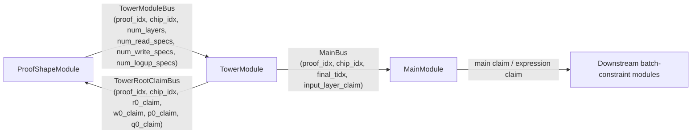
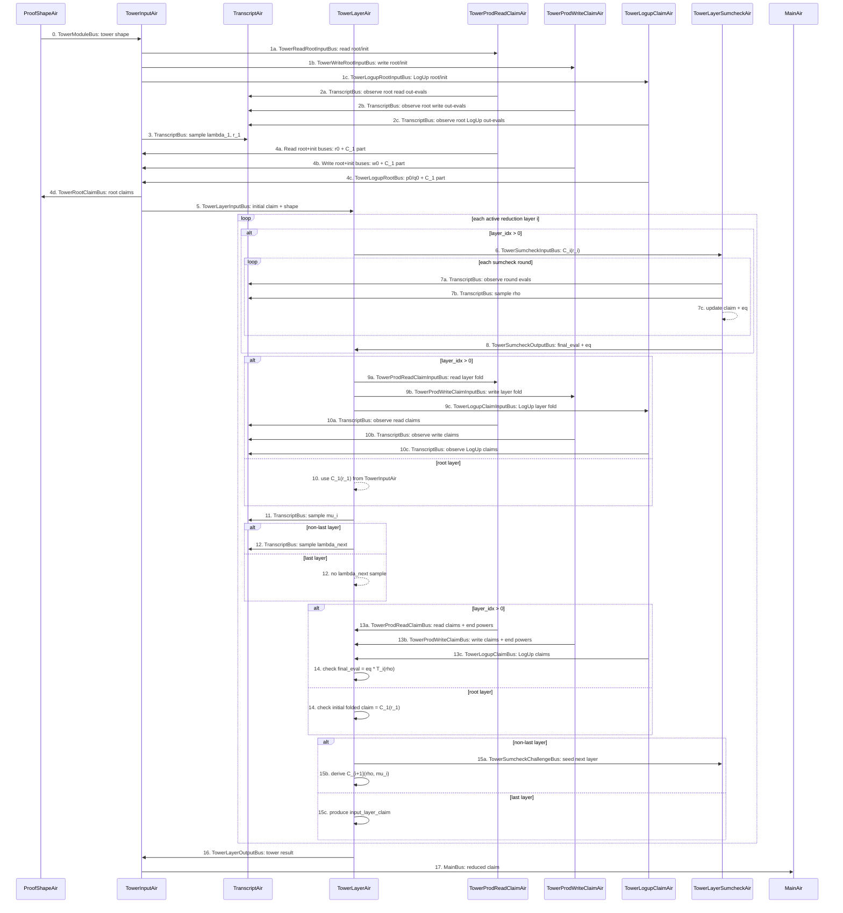

# Tower Module Design Notes

This document records the intended module boundaries for the recursive tower verifier. The lower-level AIR constraints
are specified in `tower_air_spec.md`; this file focuses on how the tower module should interact with the rest of the
recursive verifier circuit.

The tower module is verifier code. Its primary job is to verify every chip tower proof in every Ceno proof being
recursively verified: for each `(proof_idx, chip_idx)`, it replays the native Ceno tower verifier for that chip proof.
The VK-assigned `chip_id` is used to fetch metadata and the chip proof from the child proof; the tower AIR buses use
`chip_idx`, the proof-local index supplied by proof shape. Transcript order, shape metadata, batching challenges, and
exported claims must stay in lockstep with `ceno_zkvm::scheme::verifier::TowerVerify`.

## Table Of Contents

- [Scope](#scope)
- [Names And Scopes](#names-and-scopes)
- [Protocol Math](#protocol-math)
- [Module Interaction Diagram](#module-interaction-diagram)
- [External Module Boundaries](#external-module-boundaries)
- [Internal Tower Structure](#internal-tower-structure)
- [AIR Contract Priority](#air-contract-priority)
- [AIR Interaction Sequence](#air-interaction-sequence)
- [Per-AIR Contracts](#per-air-contracts)
- [Bus Summary](#bus-summary)
- [Layer Verification Contract](#layer-verification-contract)
- [Edge Cases / Zero Work Behavior](#edge-cases--zero-work-behavior)
- [Debugging Guide](#debugging-guide)
- [Design Invariants](#design-invariants)
- [Open Design Questions](#open-design-questions)

## Scope

The tower module reduces each `(proof_idx, chip_idx)` tower proof to an input-layer claim. It does not own downstream
batch-constraint semantics; the next module checks what that reduced claim means. The interaction contract is captured by
the AIR sequence diagram and the per-AIR contracts below.

The target readers are both human developers and AI agents. Prefer explicit message contracts, algebraic meanings, and
ordering rules over implicit references to current Rust struct names; the doc should be usable as a debugging guide and
as implementation context.

## Names And Scopes

Use these names consistently in diagrams, contracts, and AIR specs.

| Name | Meaning |
|------|---------|
| `proof_idx` | Logical index of the Ceno proof being recursively verified; scopes all per-proof buses. |
| `chip_id` | VK/circuit identity used outside tower AIRs to select chip metadata and fetch the chip proof from the child proof map. |
| `chip_idx` | Proof-local chip proof index supplied by `ProofShapeAir` (`sorted_idx`); together with `proof_idx`, it scopes tower and main buses. |
| `layer_idx` | Active tower layer currently being reduced inside one `(proof_idx, chip_idx)` tower proof. |
| `tidx` | Per-proof transcript cursor at which an observe/sample event occurs. |
| `num_layers` | VK/proof-shape-derived number of active tower layers for this chip tower proof. |
| `num_read_specs` | VK-derived number of read product specs for this chip. |
| `num_write_specs` | VK-derived number of write product specs for this chip. |
| `num_logup_specs` | VK-derived number of LogUp specs for this chip. |
| `num_prod_specs` | `num_read_specs + num_write_specs`; controls the product batching width. |
| `r0_claim` | Product of read root out-eval pairs for one chip tower proof: `product_k r_out_evals[k][0] * r_out_evals[k][1]`. |
| `w0_claim` | Product of write root out-eval pairs for one chip tower proof: `product_k w_out_evals[k][0] * w_out_evals[k][1]`. |
| `p0_claim` | Root LogUp numerator claim for one chip tower proof. |
| `q0_claim` | Root LogUp denominator claim for one chip tower proof. |
| `C_0([])` | Zero-variable root/output claim. It is not the initial tower sumcheck claim. |
| `initial_tower_claim` | Batched initial tower claim `C_1(r_1)` derived from root out-evals. |
| `lambda_cur` | Batching challenge for the current layer's sumcheck expected-evaluation body `T_i(rho)`. |
| `lambda_next` | Batching challenge for the next layer, used in the outgoing expected claim `C_{i+1}(rho, mu)`. |
| `rho` | Sumcheck evaluation point produced by the layer sumcheck rounds. |
| `r_i` | Current layer point in the current claim `C_i(r_i)`. |
| `mu` | Merge/interpolation challenge for deriving the next layer point and expected claim. |
| `T_i(rho)` | Current layer sumcheck expected-evaluation body computed from child claims at `rho`, before multiplying by `eq(r_i, rho)`. |
| `C_{i+1}(rho, mu)` | Next layer's expected batched claim after interpolation at `mu`. |
| `eval_claim` | A claim AIR's contribution to `T_i(rho)`. |
| `next_claim` | A claim AIR's contribution to `C_{i+1}(rho, mu)`. |
| `DeriveLayerClaims` | Claim AIR mode that outputs `(eval_claim, next_claim)` for a tower layer. |
| `DeriveOutputClaim` | Claim AIR mode that outputs chip-level root claims and `C_1(r_1)` contributions from root out-evals. |
| `input_layer_claim` | Final reduced claim after the terminal/input layer, emitted by tower to `MainBus`. |

## Protocol Math

This section is the semantic source of truth for the tower layer reduction. The AIR-specific sections in
`tower_air_spec.md` describe how the trace and buses realize these identities; protocol changes must preserve this math.

Layer `0` is the zero-variable root/output layer. It is not the initial tower sumcheck claim. The verifier first samples
`r_1` and derives the initial tower claim `C_1(r_1)` from `r_out_evals`, `w_out_evals`, and `lk_out_evals`. Separately,
the same root out-evals are also folded into
`r0_claim`, `w0_claim`, `p0_claim`, and `q0_claim` for proof-shape's cross-chip checks.

For an active tower sumcheck layer `i >= 1`, `C_i(r_i)` is the current claim passed into the sumcheck. For binary fan-in,
a child point is written as `(b, t)` with `t in {0, 1}`. The sumcheck proves the value at `r_i` by summing over Boolean
`b` with the multilinear equality polynomial `eq(r_i, b)`.

For a product spec `j`:

```text
Prod_j^i(b) = Prod_j^{i+1}(b, 0) * Prod_j^{i+1}(b, 1)

Prod_j^i(r) =
    sum_b eq(r, b) * Prod_j^{i+1}(b, 0) * Prod_j^{i+1}(b, 1)
```

For a LogUp spec `k`, with numerator `P_k` and denominator `Q_k`, the relation is fraction addition:

```text
P_k^i(b) / Q_k^i(b) =
    P_k^{i+1}(b, 0) / Q_k^{i+1}(b, 0)
  + P_k^{i+1}(b, 1) / Q_k^{i+1}(b, 1)
```

Equivalently:

```text
P_k^i(b) =
    P_k^{i+1}(b, 0) * Q_k^{i+1}(b, 1)
  + P_k^{i+1}(b, 1) * Q_k^{i+1}(b, 0)

Q_k^i(b) =
    Q_k^{i+1}(b, 0) * Q_k^{i+1}(b, 1)
```

Product specs include both read and write specs. LogUp specs contribute two batched polynomials, `P_k` and `Q_k`. For
layer `i`, `lambda_cur = lambda_i` is the batching challenge for the current sumcheck expected-evaluation body
`T_i(rho)`, and `lambda_next = lambda_{i+1}` is the fresh batching challenge for the outgoing next-layer claim. If there
are `n_prod` product specs, the flattened batching order is:

```text
Prod_0, ..., Prod_{n_prod-1}, P_0, Q_0, P_1, Q_1, ...
```

so the weights are consecutive powers of the active batching challenge.

Root read/write claims are separate cross-chip claims, not layer-sumcheck target contributions. For one chip:

```text
r0_claim = product_k r_out_evals[k][0] * r_out_evals[k][1]
w0_claim = product_k w_out_evals[k][0] * w_out_evals[k][1]
```

These products have no `lambda` weights and are not the initial tower sum. They are returned to `ProofShapeAir` so it can
check the global read/write product relation across chips.

The tower sumcheck starts from the batched initial tower claim `C_1(r_1)`, derived from the same root out-evals. For one
chip, with `n_read` read specs, `n_write` write specs, and `n_prod = n_read + n_write`:

```text
R_j(r_1) = (1 - r_1) * r_out_evals[j][0] + r_1 * r_out_evals[j][1]
W_j(r_1) = (1 - r_1) * w_out_evals[j][0] + r_1 * w_out_evals[j][1]

read_initial_claim =
    sum_{j=0}^{n_read-1} lambda_1^j * R_j(r_1)

write_initial_claim =
    sum_{j=0}^{n_write-1} lambda_1^(n_read + j) * W_j(r_1)
```

For LogUp root out-evals:

```text
P_k(r_1) = (1 - r_1) * P_k(0) + r_1 * P_k(1)
Q_k(r_1) = (1 - r_1) * Q_k(0) + r_1 * Q_k(1)

logup_initial_claim =
    sum_k lambda_1^(n_prod + 2k)     * P_k(r_1)
  + sum_k lambda_1^(n_prod + 2k + 1) * Q_k(r_1)
```

and:

```text
C_1(r_1) = read_initial_claim + write_initial_claim + logup_initial_claim
```

The root fold AIRs must use the same observed root out-eval rows for both the root claims
`(r0_claim, w0_claim, p0_claim, q0_claim)` and these initial-claim contributions. The generic batched claim at layer `i`
is:

```text
C_i(r) =
    sum_j lambda_cur^j              * Prod_j^i(r)
  + sum_k lambda_cur^{n_prod + 2k}     * P_k^i(r)
  + sum_k lambda_cur^{n_prod + 2k + 1} * Q_k^i(r)
```

Here `lambda_cur^0 = 1`, matching `get_challenge_pows`.

Substituting the layer relations gives the current layer sumcheck expected-evaluation body:

```text
C_i(r) = sum_b eq(r, b) * T_i(b)

T_i(b) =
    sum_j lambda_cur^j * Prod_j^{i+1}(b, 0) * Prod_j^{i+1}(b, 1)

  + sum_k lambda_cur^{n_prod + 2k} * (
        P_k^{i+1}(b, 0) * Q_k^{i+1}(b, 1)
      + P_k^{i+1}(b, 1) * Q_k^{i+1}(b, 0)
    )

  + sum_k lambda_cur^{n_prod + 2k + 1} * (
        Q_k^{i+1}(b, 0) * Q_k^{i+1}(b, 1)
    )
```

If the sumcheck samples point `rho`, its final evaluation is:

```text
claim_out = eq(r_i, rho) * T_i(rho)
```

where `eq(r_i, rho)` is accumulated round-by-round as:

```text
eq_next = eq_cur * (xi * rho_i + (1 - xi) * (1 - rho_i))
```

Verifier view for active tower layer `i >= 1`:

1. Verify the sumcheck proof for the current claim `C_i(r_i)`. The proof returns the point `rho` and a final evaluation.
   The child layer claims at that point are:

   ```text
   Prod_j^{i+1}(rho, 0), Prod_j^{i+1}(rho, 1)

   P_k^{i+1}(rho, 0), P_k^{i+1}(rho, 1),
   Q_k^{i+1}(rho, 0), Q_k^{i+1}(rho, 1)
   ```

   From those claims, compute:

   ```text
   T_i(rho) =
       sum_j lambda_cur^j * Prod_j^{i+1}(rho, 0) * Prod_j^{i+1}(rho, 1)

     + sum_k lambda_cur^{n_prod + 2k} * (
           P_k^{i+1}(rho, 0) * Q_k^{i+1}(rho, 1)
         + P_k^{i+1}(rho, 1) * Q_k^{i+1}(rho, 0)
       )

     + sum_k lambda_cur^{n_prod + 2k + 1} * (
           Q_k^{i+1}(rho, 0) * Q_k^{i+1}(rho, 1)
       )
   ```

   The sumcheck final evaluation must equal `eq(r_i, rho) * T_i(rho)`.

2. If layer `i + 1` is not terminal, derive the next layer's expected sum after sampling `mu` and a fresh batching
   challenge `lambda_next`:

   ```text
   r_next = (rho, mu)

   C_{i+1}(r_next) =
       sum_j lambda_next^j * Prod_j^{i+1}(r_next)
     + sum_k lambda_next^{n_prod + 2k}     * P_k^{i+1}(r_next)
     + sum_k lambda_next^{n_prod + 2k + 1} * Q_k^{i+1}(r_next)
   ```

   Each carried claim is the multilinear interpolation at `mu`:

   ```text
   Prod_j^{i+1}(r_next) =
       (1 - mu) * Prod_j^{i+1}(rho, 0)
     + mu       * Prod_j^{i+1}(rho, 1)
   ```

   with the same interpolation for each LogUp `P_k` and `Q_k`. Specs that have no remaining reduction round do not
   contribute to the next expected sum.

Both LogUp cross terms in `T_i` are part of the semantic statement. If an implementation splits or reuses accumulators,
the final sumcheck target must still include the `P0 * Q1 + P1 * Q0` numerator-cross contribution and the `Q0 * Q1`
denominator-cross contribution with their corresponding powers of `lambda_cur`.

## Module Interaction Diagram

The diagram below is the high-level circuit contract. It shows which modules own shape, tower verification, and
downstream claim checking for each `(proof_idx, chip_idx)` tower proof.



Boundary rules:

- `ProofShapeModule` is the source of VK-derived tower shape metadata and checks cross-chip root claims.
- `TowerModule` verifies the tower proof and emits reduced claims; it does not interpret downstream constraint
  semantics.
- `MainModule` and downstream modules check the reduced claim against the rest of the recursive verifier statement.

## External Module Boundaries

### Proof Shape Module

There is one native tower proof per proof-shape chip row per Ceno proof. The proof-shape side owns the VK-derived shape
metadata for each selected `chip_id`, assigns that chip proof its proof-local `chip_idx`, and starts each tower
verification by sending `TowerModuleMessage`:

```text
(
  proof_idx,
  chip_idx,
  num_layers,
  num_read_specs,
  num_write_specs,
  num_logup_specs
)
```

where:

- `proof_idx` scopes the Ceno proof being recursively verified. In the current typed per-proof bus implementation this
  may be the bus key rather than a field inside the message payload;
- `chip_idx` is `ProofShapeAir`'s sorted proof-local index for this chip proof;
- `chip_id` remains the VK/circuit identity used before this bus message to select `num_*` metadata and locate the child
  chip proof, but it is not the tower bus key;
- `num_layers` is the number of active tower layers for this chip's tower proof in this Ceno proof;
- `num_read_specs`, `num_write_specs`, and `num_logup_specs` are selected from the chip VK.

The proof-shape-to-tower message is shape metadata only. It should not carry transcript cursor state such as
`tower_tidx`; transcript scheduling belongs to the transcript/tower transcript contract. The tower row identity is
`(proof_idx, chip_idx)`. Implementations may keep `chip_id` in preflight records for VK/proof lookup, but AIR messages
must not use it as the tower proof key.

For the selected chip VK, proof-shape derives:

```text
num_read_specs  = num_read_count
num_write_specs = num_write_count
num_logup_specs = num_logup_count
num_prod_specs  = num_read_specs + num_write_specs
```

These are extracted from the child VK constraint system, not from the proof. Tower uses them as the trusted shape for
the corresponding chip tower proof:

- `tower_proof.prod_specs_eval.len() == num_prod_specs`;
- `tower_proof.logup_specs_eval.len() == num_logup_specs`;
- initial and per-layer batching use `num_prod_specs + 2 * num_logup_specs` powers of `lambda_cur` for
  expected-evaluation checks and `lambda_next` for outgoing next-layer claims;
- read/write/LogUp claim AIRs use `num_read_specs`, `num_write_specs`, and `num_logup_specs` when folding child claims.

Tower also relies on proof-shape/metadata checks for:

- number of product specs;
- number of LogUp specs;
- number of active layers;
- per-layer read/write/LogUp accumulator counts;
- active evaluation-row counts for each spec;
- trace heights and padding rules for tower AIRs.

Shape metadata is security relevant. If the recursive verifier accepts a different active-round schedule or different
product/LogUp spec counts than the native verifier, it can verify a different tower statement.

### Main / Downstream Claim Module

`TowerInputAir` emits the reduced tower claim through `MainBus`, keyed by `proof_idx`:

```text
MainMessage { chip_idx, tidx, claim }
```

This claim is the tower output after all active layers have been reduced to the input layer. The downstream main/batch
constraint path owns the interpretation of that claim against constraint expressions or committed evaluations.

The tower output boundary should specify:

- the final transcript cursor after tower processing;
- the reduced input-layer claim;
- the final layer batching challenge and merge challenge if downstream modules need them;
- the exact `chip_idx` and `proof_idx` scoping rules for multi-proof aggregation.

## Internal Tower Structure

The current internal split is:

```text
TowerInputAir
  receives the tower task, samples the initial tower challenge, and sends/receives layer-level messages

TowerLayerAir
  orchestrates layer-to-layer reduction, count checks, layer challenges, and final layer output

TowerLayerSumcheckAir
  verifies each layer sumcheck proof round and returns (claim_out, eq_at_r_prime)

TowerProdClaimAir
  folds read/write product child claims for each layer

TowerLogupClaimAir
  folds LogUp child claims for each layer
```

`TowerLayerAir` rows are ordered as a three-level loop: `proof_idx > chip_idx > layer_idx`. The first two counters scope
the tower proof, and `layer_idx` walks the active tower layers inside that proof-local chip proof.

The internal AIR split may change, but the module boundary should continue to expose protocol-level values:

```text
current claim:  C_i(r_i)
expected eval:  T_i(rho)
next layer:     C_{i+1}(rho, mu)
terminal layer: reduced input-layer claim
```

Use `lambda_cur` for the current layer expected-evaluation path `T_i(rho)` and `lambda_next` for the outgoing
`C_{i+1}(rho, mu)` path.

The claim bus structs use `next_claim` and `eval_claim` with the following contract-level meanings:

```text
next_claim       = contribution to C_{i+1}(rho, mu)
eval_claim       = contribution to T_i(rho)
```

`eval_claim` is not the current claim. The current claim is `C_i(r_i)`, the value passed into the sumcheck proof.

## AIR Contract Priority

The first specification target is the contract of each AIR: what statement it receives, what statement it emits, and
which other AIR is responsible for checking the linked statement. Local row constraints are secondary; once the contract
is fixed, missing local constraints can be filled in mechanically.

For tower, an AIR contract should state:

- the exact bus messages received and sent;
- the transcript events the AIR owns, in native verifier order;
- the algebraic meaning of each emitted claim;
- the `proof_idx` and `chip_idx` scope of every message;
- the zero-work behavior when a chip has no tower interactions.

The corresponding `tower_air_spec.md` should start each AIR section with this contract before listing column-level
constraints.

## AIR Interaction Sequence

For both human developers and AI agents, the diagram below is the first-pass debugging reference for one
`(proof_idx, chip_idx)` tower proof. It shows the expected order of bus sends/receives and transcript interactions. A
constraint error should usually map to one arrow: either the producer did not send the matching message, the consumer
used the wrong scope/counter, or a transcript event was placed at the wrong `tidx`. Exact cursor arithmetic is handled by
the `tidx` columns and `tower_transcript_len`.

Only `TranscriptBus` arrows define transcript chronology. Other arrows are bus dependencies between AIR rows; they can
carry values whose transcript samples occur earlier or later in native verifier order. When debugging a bus failure, map
the failing bus to the nearest arrow with the same producer/consumer pair, then check scope fields, counters, and
`tidx`. When debugging transcript failures, ignore non-transcript arrows and follow only the numbered `TranscriptBus`
events.



Step 3 represents two transcript samples with distinct cursor positions: `lambda_1` followed by `r_1`.
The step-1 root input buses may carry `lambda_1` and `r_1` as values even though the transcript samples occur at step 3.
Only `TranscriptBus` arrows define transcript chronology. The root AIRs must use the same observed out-eval rows for both
the step-4 root claims and the step-4 initial-claim contributions. Product root fold AIRs send separate root and init
buses from the same final accumulator row; the LogUp root fold AIR sends `(p0_claim, q0_claim, logup_initial_claim)` in
one `TowerLogupRootBus` message from that row.

## Per-AIR Contracts

Read this section as the semantic contract for each participant. It intentionally does not repeat full bus payloads; the
bus table below is the source of truth for producer, consumer, payload, and scope. If a bus-balance error needs exact
fields, go to the bus table first. If the bus balances but the proof is semantically wrong, use this section.

### ProofShapeAir

`ProofShapeAir` is outside the tower module. It owns VK-derived shape truth and must not derive tower counts from the
proof. For each selected `chip_id`, it sends `num_layers`, `num_read_specs`, `num_write_specs`, and `num_logup_specs` to
`TowerInputAir` under the proof-local `(proof_idx, chip_idx)` tower identity.

It also consumes each chip's root claims from `TowerInputAir` and, across all chips in the same `proof_idx`, enforces:

```text
prod_chip r0_claim = prod_chip w0_claim
sum_chip p0_claim / q0_claim = 0 / x
```

Equivalently, the product of read roots equals the product of write roots, and the sum of all chip LogUp fractional
pairs has zero numerator. These root claims are not the same as `initial_tower_claim = C_1(r_1)` or any `T_i(rho)`
expected-evaluation contribution. The denominator value `x` is unconstrained except that the fraction representation must
follow the LogUp/fraction-folding contract used by the downstream proof-shape checks.

### TowerInputAir

`TowerInputAir` is the per-`(proof_idx, chip_idx)` tower entry and exit boundary.

- one active `TowerInputAir` row corresponds to one `(proof_idx, chip_idx)` tower proof;
- it anchors the VK-derived spec counts to the tower instance, but does not derive them;
- it obtains tower transcript cursor state from the transcript/tower transcript contract, not from `TowerModuleBus`;
- it sends output-mode fold tasks to the product and LogUp claim AIRs; these tasks may carry `lambda_1` and `r_1` as
  data even though transcript chronology is enforced only by `TranscriptBus`;
- it receives root initial-claim contributions and computes
  `initial_tower_claim = read_initial_claim + write_initial_claim + logup_initial_claim`;
- it forwards `num_layers`, spec counts, and `initial_tower_claim = C_1(r_1)` to `TowerLayerAir`;
- it returns `r0_claim`, `w0_claim`, `p0_claim`, and `q0_claim` to `ProofShapeAir` for cross-chip root checks;
- it routes the final reduced input-layer claim to `MainBus` under the same `chip_idx`;
- if `num_layers = 0` or all spec counts are zero, it must not create active layer work and must use the documented
  zero-work output behavior.

### TowerLayerAir

`TowerLayerAir` is the layer orchestrator. It owns the transition from one tower layer claim to the next expected claim.

- for layer `i`, it supplies the claim that the layer sumcheck must verify;
- from claim AIR outputs, it derives the expected-evaluation body `T_i(rho)` and checks the sumcheck final evaluation against
  `eq(r_i, rho) * T_i(rho)`;
- if another layer remains, it derives the next expected claim `C_{i+1}(rho, mu)`;
- if this is the terminal/input layer, it emits the reduced `input_layer_claim`;
- it owns `lambda_cur`/`lambda_next` power handoff between read products, write products, and LogUp specs;
- it checks read/write/LogUp counts against the shape metadata forwarded from `TowerInputAir`/`TowerModuleBus`, not
  against proof-provided lengths alone.
- root output/init folding is handled by `TowerInputAir`'s root buses; `TowerLayerAir` sends product/LogUp claim-folding
  buses only for non-root layers.

### TowerLayerSumcheckAir

`TowerLayerSumcheckAir` owns only the sumcheck transcript and sumcheck algebra for one layer.

- it verifies the univariate sumcheck rounds starting from the input claim;
- it emits the final sumcheck evaluation and `eq_at_r_prime = eq(r_i, rho)`;
- it does not know product or LogUp semantics; `TowerLayerAir` interprets the final evaluation against `T_i(rho)`.

### TowerProdReadClaimAir and TowerProdWriteClaimAir

The read and write product claim AIRs have the same contract, with separate buses. Each AIR supports two modes:

```text
DeriveLayerClaims:
  consumes layer child claims and returns (next_claim, eval_claim)

DeriveOutputClaim:
  consumes root out-eval pairs and returns r0_claim/w0_claim plus the C_1 contribution
```

- in `DeriveLayerClaims` mode, rows have `layer_idx > 0`; root rows use `DeriveOutputClaim` mode only;
- in `DeriveLayerClaims` mode, `current_claim` is the current code/bus name for this product group's `eval_claim`, i.e.
  its contribution to `T_i(rho)`;
- in `DeriveLayerClaims` mode, `next_claim` is this product group's contribution to `C_{i+1}(rho, mu)`;
- in `DeriveLayerClaims` mode, `prod_offset` is the first flattened product index handled by this AIR instance: `0` for
  read products and `num_read_specs` for write products;
- in `DeriveLayerClaims` mode, `lambda_next_start` and `lambda_cur_start` are the batching powers at `prod_offset`;
- in `DeriveLayerClaims` mode, `lambda_next_end` and `lambda_cur_end` are the batching powers immediately after this
  product group and must be used as the next group's start powers;
- in `DeriveOutputClaim` mode, `output_claim = product_k P_k(0) * P_k(1)`;
- in `DeriveOutputClaim` mode,
  `initial_claim = sum_k lambda_1^(prod_offset + k) * ((1 - r_1) * P_k(0) + r_1 * P_k(1))`;
- in `DeriveOutputClaim` mode, the read AIR returns `r0_claim` and the write AIR returns `w0_claim`;
- in `DeriveOutputClaim` mode, the read/write initial claims are contributions to `initial_tower_claim = C_1(r_1)`;
- in `DeriveOutputClaim` mode, the root bus and init bus are sent by the same final accumulator row;
- `num_prod_count` fixes the number of active read or write product accumulator rows for the selected chip/layer or root
  claim group;
- the AIR owns the transcript observation of the product child claims but not the layer-level sumcheck check.

### TowerLogupClaimAir

`TowerLogupClaimAir` folds the LogUp numerator/denominator child claims. It supports two modes:

```text
DeriveLayerClaims:
  consumes layer child claims and returns (next_claim, eval_claim)

DeriveOutputClaim:
  consumes root LogUp out-evals and returns (p0_claim, q0_claim) plus the C_1 contribution
```

- in `DeriveLayerClaims` mode, rows have `layer_idx > 0`; root rows use `DeriveOutputClaim` mode only;
- in `DeriveLayerClaims` mode, `current_claim` is the current code/bus name for this LogUp group's `eval_claim`, i.e. its
  contribution to `T_i(rho)` using the native numerator/denominator reduction;
- in `DeriveLayerClaims` mode, `next_claim` is the LogUp contribution to `C_{i+1}(rho, mu)` after interpolation at `mu`;
- in `DeriveLayerClaims` mode, `lambda_next_start` and `lambda_cur_start` must equal the product write end powers, i.e.
  the powers at `num_read_specs + num_write_specs`;
- in `DeriveLayerClaims` mode, each LogUp accumulator row consumes two batching powers: one for `P_k` and one for `Q_k`;
- in `DeriveOutputClaim` mode, each row computes
  `P_cross = P(0) * Q(1) + P(1) * Q(0)` and `Q_cross = Q(0) * Q(1)`;
- in `DeriveOutputClaim` mode, the AIR folds `p0_claim / q0_claim = sum_k P_cross_k / Q_cross_k`;
- in `DeriveOutputClaim` mode, the AIR also folds:

  ```text
  logup_initial_claim =
      sum_k lambda_1^(logup_offset + 2k)     * P_k(r_1)
    + sum_k lambda_1^(logup_offset + 2k + 1) * Q_k(r_1)
  ```

- in `DeriveOutputClaim` mode, `TowerLogupRootBus` returns `(p0_claim, q0_claim, logup_initial_claim)` from the same
  final accumulator row;
- `num_logup_count` fixes the number of active LogUp accumulator rows for the selected chip/layer or root claim group;
- it observes LogUp child claims in the same order as the native verifier.

## Bus Summary

All quantities are scoped by `proof_idx`. `PermutationCheck` buses are typed per-proof permutation buses unless noted
otherwise. Tower-specific buses are further scoped by `chip_idx`, so `(proof_idx, chip_idx)` identifies the chip tower
proof inside the recursive verifier. The `TowerModuleBus` payload is the proof-shape metadata:
`(proof_idx, chip_idx, num_layers, num_read_specs, num_write_specs, num_logup_specs)`. If `proof_idx` is already the
typed per-proof bus key, the implementation may omit it from the message struct while preserving it as part of the
logical contract. `chip_id` is intentionally absent from these payloads; it is only used before trace generation to select
VK metadata and proof-map entries.

For bus-balance logs, a positive count is a send and a negative count is a receive. In BabyBear logs the raw value
`2013265920` is `-1`. The first debugging question is therefore: "which row should have produced the exact same payload
under the opposite sign?"

| Bus | Bus Type | Producer | Consumer | Payload | Scope | Meaning |
|-----|----------|----------|----------|---------|-------|---------|
| `TowerModuleBus` | `PermutationCheck` | `ProofShapeAir` | `TowerInputAir` | `(proof_idx, chip_idx, num_layers, num_read_specs, num_write_specs, num_logup_specs)` | per `(proof_idx, chip_idx)` tower proof | Starts one tower verification with VK-derived shape metadata. |
| `TowerLayerInputBus` | `PermutationCheck` | `TowerInputAir` | `TowerLayerAir` | `(chip_idx, layer_tidx, num_layers, num_read_specs, num_write_specs, num_logup_specs, initial_tower_claim)` | per `(proof_idx, chip_idx)` tower proof | Anchors the initial batched tower claim and shape counts for all tower layers. |
| `TowerLayerOutputBus` | `PermutationCheck` | `TowerLayerAir` | `TowerInputAir` | `(chip_idx, final_tidx, layer_idx_end, input_layer_claim, lambda_next, mu)` | per `(proof_idx, chip_idx)` tower proof | Returns the reduced terminal/input-layer tower claim. |
| `TowerReadRootInputBus` | `PermutationCheck` | `TowerInputAir` | `TowerProdReadClaimAir` | `(chip_idx, claim_tidx, lambda_1, r_1, lambda_1_start, num_read_count)` | per `(proof_idx, chip_idx)` root claim group | Starts read root product folding and passes the initial-claim challenges. |
| `TowerReadRootBus` | `PermutationCheck` | `TowerProdReadClaimAir` | `TowerInputAir` | `(chip_idx, r0_claim)` | per `(proof_idx, chip_idx)` root claim group | Returns `r0_claim = product_k r_out_evals[k][0] * r_out_evals[k][1]`. |
| `TowerReadInitBus` | `PermutationCheck` | `TowerProdReadClaimAir` | `TowerInputAir` | `(chip_idx, read_initial_claim)` | per `(proof_idx, chip_idx)` root claim group | Returns the read contribution to `C_1(r_1)` from the same rows as `r0_claim`. |
| `TowerWriteRootInputBus` | `PermutationCheck` | `TowerInputAir` | `TowerProdWriteClaimAir` | `(chip_idx, claim_tidx, lambda_1, r_1, lambda_1_start, num_write_count)` | per `(proof_idx, chip_idx)` root claim group | Starts write root product folding and passes the initial-claim challenges. |
| `TowerWriteRootBus` | `PermutationCheck` | `TowerProdWriteClaimAir` | `TowerInputAir` | `(chip_idx, w0_claim)` | per `(proof_idx, chip_idx)` root claim group | Returns `w0_claim = product_k w_out_evals[k][0] * w_out_evals[k][1]`. |
| `TowerWriteInitBus` | `PermutationCheck` | `TowerProdWriteClaimAir` | `TowerInputAir` | `(chip_idx, write_initial_claim)` | per `(proof_idx, chip_idx)` root claim group | Returns the write contribution to `C_1(r_1)` from the same rows as `w0_claim`. |
| `TowerLogupRootInputBus` | `PermutationCheck` | `TowerInputAir` | `TowerLogupClaimAir` | `(chip_idx, claim_tidx, lambda_1, r_1, lambda_1_start, num_logup_count)` | per `(proof_idx, chip_idx)` root claim group | Starts root LogUp fractional folding and passes the initial-claim challenges. |
| `TowerLogupRootBus` | `PermutationCheck` | `TowerLogupClaimAir` | `TowerInputAir` | `(chip_idx, p0_claim, q0_claim, logup_initial_claim)` | per `(proof_idx, chip_idx)` root claim group | Returns the chip-level root LogUp fractional pair and the LogUp contribution to `C_1(r_1)` from the same rows. |
| `TowerProdReadClaimInputBus` | `PermutationCheck` | `TowerLayerAir` | `TowerProdReadClaimAir` | `(chip_idx, layer_idx, claim_tidx, lambda_next, lambda_cur, mu, prod_offset, lambda_next_start, lambda_cur_start, num_read_count)` | per non-root `(proof_idx, chip_idx, layer_idx)` | Starts read product child-claim folding at flattened product offset `0`; start powers are one. |
| `TowerProdReadClaimBus` | `PermutationCheck` | `TowerProdReadClaimAir` | `TowerLayerAir` | `(chip_idx, layer_idx, read_next_claim, read_current_claim, lambda_next_end, lambda_cur_end)` | per non-root `(proof_idx, chip_idx, layer_idx)` | Returns read product contributions and the powers after the read product range. |
| `TowerProdWriteClaimInputBus` | `PermutationCheck` | `TowerLayerAir` | `TowerProdWriteClaimAir` | `(chip_idx, layer_idx, claim_tidx, lambda_next, lambda_cur, mu, prod_offset, lambda_next_start, lambda_cur_start, num_write_count)` | per non-root `(proof_idx, chip_idx, layer_idx)` | Starts write product child-claim folding at `num_read_specs`; start powers are the read product end powers. |
| `TowerProdWriteClaimBus` | `PermutationCheck` | `TowerProdWriteClaimAir` | `TowerLayerAir` | `(chip_idx, layer_idx, write_next_claim, write_current_claim, lambda_next_end, lambda_cur_end)` | per non-root `(proof_idx, chip_idx, layer_idx)` | Returns write product contributions and the powers after the full product range. |
| `TowerLogupClaimInputBus` | `PermutationCheck` | `TowerLayerAir` | `TowerLogupClaimAir` | `(chip_idx, layer_idx, claim_tidx, lambda_next, lambda_cur, mu, lambda_next_start, lambda_cur_start, num_logup_count)` | per non-root `(proof_idx, chip_idx, layer_idx)` | Starts LogUp numerator/denominator child-claim folding at the product write end powers. |
| `TowerLogupClaimBus` | `PermutationCheck` | `TowerLogupClaimAir` | `TowerLayerAir` | `(chip_idx, layer_idx, logup_next_claim, logup_current_claim)` | per non-root `(proof_idx, chip_idx, layer_idx)` | Returns LogUp contributions to `C_{i+1}(rho, mu)` and `T_i(rho)`. |
| `TowerSumcheckInputBus` | `PermutationCheck` | `TowerLayerAir` | `TowerLayerSumcheckAir` | `(chip_idx, layer_idx, is_last_layer, sumcheck_tidx, claim)` | per `(proof_idx, chip_idx, layer_idx)` | Starts the layer sumcheck from current claim `C_i(r_i)`. |
| `TowerSumcheckOutputBus` | `PermutationCheck` | `TowerLayerSumcheckAir` | `TowerLayerAir` | `(chip_idx, layer_idx, tidx_after_sumcheck, final_evaluation, eq_at_r_prime)` | per `(proof_idx, chip_idx, layer_idx)` | Returns the sumcheck final evaluation and `eq(r_i, rho)`. |
| `TowerSumcheckChallengeBus` | `PermutationCheck` | `TowerLayerAir`, `TowerLayerSumcheckAir` | `TowerLayerSumcheckAir` | `(chip_idx, layer_idx, round, challenge)` | per `(proof_idx, chip_idx, layer_idx, round)` | Links each round challenge, including the layer-to-layer `mu` when it seeds the next layer. |
| `TowerRootClaimBus` | `PermutationCheck` | `TowerInputAir` | `ProofShapeAir` | `(chip_idx, r0_claim, w0_claim, p0_claim, q0_claim)` | per `(proof_idx, chip_idx)` tower proof | Returns chip root claims so proof-shape can enforce cross-chip product and LogUp fraction checks. |
| `TranscriptBus` | `PermutationCheck` | `TranscriptAir` for samples; tower AIRs for observations | `TowerInputAir`, `TowerLayerAir`, `TowerLayerSumcheckAir`, product/logup claim AIRs for samples; `TranscriptAir` for observations | `(tidx, value, access metadata)` | per-proof | Enforces native verifier observe/sample order. |
| `MainBus` | `PermutationCheck` | `TowerInputAir` | `MainAir` | `(chip_idx, final_tidx, input_layer_claim)` | per `(proof_idx, chip_idx)` main claim | Exports the reduced tower claim for downstream constraint checking. |

## Layer Verification Contract

Layer `0` is a zero-variable root/output layer. It is not the initial tower sumcheck claim. The initial tower sumcheck
claim is `C_1(r_1)`. For each non-terminal active layer `i >= 1`, tower verifies two related values from the same
child-layer claims.

First, it verifies the current sumcheck output. The current claim is `C_i(r_i)`, and the final sumcheck evaluation must
match the expected-evaluation body:

```text
sumcheck_final_eval = eq(r_i, rho) * T_i(rho)
```

where `T_i(rho)` is computed from:

```text
Prod_j^{i+1}(rho, 0), Prod_j^{i+1}(rho, 1)
P_k^{i+1}(rho, 0),    P_k^{i+1}(rho, 1)
Q_k^{i+1}(rho, 0),    Q_k^{i+1}(rho, 1)
```

Second, if another layer remains, it derives the next layer's expected claim:

```text
C_{i+1}(rho, mu)
```

using interpolation at `mu` and fresh `lambda_next` powers. Specs that have no remaining active round must not contribute
to this next expected claim.

## Edge Cases / Zero Work Behavior

These cases must be explicit because they affect bus multiplicities, transcript cursor movement, and whether inactive
rows are allowed to send messages.

- **Zero tower work:** if a selected `(proof_idx, chip_idx)` has `num_layers = 0` or all spec counts are zero,
  `TowerInputAir` must still consume the proof-shape task, but it must not create active layer, sumcheck, product, or
  LogUp work. The exported claim and transcript movement must match the native verifier's documented zero-work behavior.
- **Zero read specs:** `TowerProdReadClaimAir` has no active child claims. It must create no positive-count read
  folding work; any required zero-count boundary message must be fully scoped and masked. The read contribution to both
  `T_i(rho)` and `C_{i+1}(rho, mu)` is zero.
- **Zero write specs:** `TowerProdWriteClaimAir` has no active child claims. It must create no positive-count
  write folding work; any required zero-count boundary message must be fully scoped and masked. The write contribution
  to both `T_i(rho)` and `C_{i+1}(rho, mu)` is zero.
- **Zero LogUp specs:** `TowerLogupClaimAir` has no active child claims. It must create no positive-count LogUp
  folding work; any required zero-count boundary message must be fully scoped and masked. The LogUp contribution to both
  `T_i(rho)` and `C_{i+1}(rho, mu)` is zero.
- **Inactive specs in later layers:** a spec that has no remaining active round must not contribute to the next expected
  claim and must not consume proof-provided child evaluations for that inactive layer.
- **Terminal/input layer:** the terminal layer checks the current sumcheck output against `T_i(rho)` and then emits
  `input_layer_claim`. It must not derive or send a non-terminal `C_{i+1}(rho, mu)` claim.
- **Shape mismatch:** if proof-provided lengths, active row counts, or layer counts disagree with proof-shape/VK
  metadata, the recursive verifier must reject through unsatisfied constraints rather than adapting to the proof shape.
- **Padding rows:** padded rows may carry default values only when their send/receive multiplicities are fully masked.
  A padded row must not create transcript, bus, or count effects.

## Debugging Guide

Use the sequence diagram first, then this table. Most failures should reduce to one producer/consumer pair, one scope
field, or one transcript cursor.

| Symptom | Check first | Likely broken contract |
|---------|-------------|------------------------|
| `TowerModuleBus` receive does not match | `proof_idx`, `chip_idx`, and VK-derived counts from proof-shape | Proof-shape sent the wrong tower task or tower consumed it under the wrong scope. |
| Multiple or missing tower input rows for a chip | one active `TowerInputAir` row per `(proof_idx, chip_idx)` | Tower proof identity is not keyed exactly by `(proof_idx, chip_idx)`. |
| Product or LogUp claim count mismatch | `num_read_specs`, `num_write_specs`, `num_logup_specs`, and per-layer active counts | Claim AIR is using proof-provided lengths or stale forwarded counts instead of `TowerModuleBus` shape metadata. |
| Product write claim bus fails but read claim bus balances | `prod_offset`, `lambda_next_start`, `lambda_cur_start` on write input | Write product folding did not start at the read product end powers. |
| LogUp claim bus fails with paired send/receive payloads differing only in last limbs | `lambda_next_start`, `lambda_cur_start`, and two-power LogUp progression | LogUp folding did not start after all product specs or advanced by one power instead of two. |
| Sumcheck rounds fail before final evaluation | `TowerSumcheckInputBus`, round challenges, and transcript observations | `TowerLayerSumcheckAir` is not replaying the native sumcheck transcript/algebra for this layer. |
| Sumcheck final evaluation fails | `eq_at_r_prime`, `eval_claim` outputs (`*_current_claim` in code), and construction of `T_i(rho)` | `TowerLayerAir` assembled the expected-evaluation body incorrectly, or the claim AIRs swapped eval/next claims. |
| Next layer expected claim is wrong | `next_claim` outputs, `mu`, inactive spec masks, and fresh `lambda_next` powers | `TowerLayerAir` derived `C_{i+1}(rho, mu)` with the wrong interpolation challenge or batching weights. |
| Terminal layer still expects another layer | `layer_idx`, `num_layers`, and `is_last_layer` | Terminal/non-terminal gating is wrong, causing an invalid `C_{i+1}` transition. |
| `TranscriptBus` failure at a specific `tidx` | nearest numbered arrow in the AIR sequence diagram | The owner AIR observed or sampled at the wrong cursor, wrong order, or wrong multiplicity. |
| `MainBus` claim mismatch | `TowerLayerOutputBus` and `TowerInputAir` export row | Tower emitted the wrong `input_layer_claim` or changed `chip_idx`/`final_tidx` at the boundary. |
| Cross-proof or cross-chip leakage | all bus scope fields and typed per-proof bus instances | A message omitted `chip_idx`, used `chip_id` as a tower key, used the wrong per-proof bus key, or reused state across tower proofs. |

## Design Invariants

- **Transcript lockstep:** every observe/sample event must match the native verifier order, labels, and cursor length.
- **Fresh layer batching:** each layer samples a fresh batching challenge; specs within that layer use its powers.
- **Shape agreement:** proof-shape metadata must force the same active spec/layer schedule as the native verifier.
- **No hidden semantics in column names:** protocol docs should describe `T_i(rho)` and `C_{i+1}(rho, mu)`, not rely on
  implementation-specific column names.
- **Downstream ownership:** tower emits the reduced claim; downstream modules check the claim's constraint semantics.

## Open Design Questions

- Should proof-shape metadata provide per-spec active-round lengths directly, rather than deriving them from counts in
  tracegen?
- Should transcript cursor arithmetic remain closed-form in tower AIRs, or be centralized in a schedule/preflight table?
