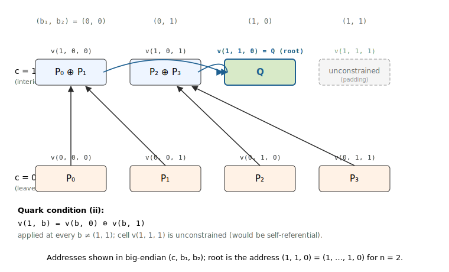

## EC-Sum Quark PIOP

This note documents the **EC-sum Quark PIOP** implemented in Ceno, used to
accumulate $N$ elliptic-curve points on a short-Weierstrass curve
$y^2 = x^3 + ax + b$ into a single sum

$$
Q = P\_0 + P\_1 + \cdots + P\_{N-1}, \qquad P\_i = (x\_i, y\_i) \in E(\mathbb{F}\_{q^7}), \tag{1}
$$

inside a single GKR layer. Coordinates live in the septic extension
$\mathbb{F}\_{q^7}$, so every algebraic relation below expands into $7$
base-field scalar relations (one per basis component).

#### Why this PIOP exists

The textbook way to prove a sum of $N$ values is a **binary accumulation
tree**: pair leaves into $N/2$ partial sums, pair those into $N/4$, and
so on, with $\log\_2 N$ layers. Implemented as a tower-style GKR circuit,
the intermediate layer values are *derived* — not committed — but the
protocol pays for one **sumcheck instance per layer** to reduce a claim
at layer $k$ to a claim at layer $k+1$:

> Toy: $N = 4$ ($\log\_2 N = 2$ layers) ⇒ $2$ sumcheck instances.
>
> Real: $N = 2^{20}$ ⇒ $20$ sumcheck instances.

The Quark method (Setty–Lee [[Quark]](#quark)) collapses the tower into a
**single** MLE identity (condition (ii) below) and discharges the whole
tree with **one** sumcheck over a domain of size $2N$, regardless of
depth.

#### The Quark encoding

Pack the entire accumulation tree — leaves *and* every intermediate
partial sum — into one multilinear extension
$v: B\_{n+1} \to \mathbb{F}\_{q^7}$ by imposing three structural
conditions:

$$
\begin{aligned}
\text{(i)} \quad & v(0, \mathbf{b}) = P\_{\mathbf{b}}, && \forall \quad \mathbf{b} \in B\_n, \\\\
\text{(ii)} \quad & v(1, \mathbf{b}) = v(\mathbf{b}, 0) \oplus v(\mathbf{b}, 1), && \forall \quad \mathbf{b} \in B\_n \setminus \\{(1, \ldots, 1)\\}, \\\\
\text{(iii)} \quad & v(1, 1, \ldots, 1) \text{ is unconstrained.} &&
\end{aligned}
\tag{2}
$$

Here $\oplus$ is elliptic-curve addition and $P\_{\mathbf{b}}$
is the input point at the leaf address $\mathbf{b}$. Condition (ii) is
**self-referential**: its right-hand side looks up $v$ at two addresses
$(\mathbf{b}, 0)$ and $(\mathbf{b}, 1)$ that are themselves either leaves
(if the leading bit of $\mathbf{b}$ is $0$) or interior nodes (if it is
$1$). Walking the recursion from $\mathbf{b} = (0, \ldots, 0)$ outwards
reconstructs the full binary tree inside $v$. The cell
$v(1, 1, \ldots, 1)$ is left free because forcing condition (ii) there
would collapse the root to the identity.

The accumulated sum $Q$ sits at the **root address**

$$
Q = v(1, 1, \ldots, 1, 0). \tag{3}
$$

**Example ($N = 4$).** With $n = 2$, $v$ has $3$ Boolean variables
$(c, b\_1, b\_2)$ and $2^{n+1} = 8$ cells. Four cells at $c = 0$ hold the
inputs; four cells at $c = 1$ hold interior partial sums, with one cell
unconstrained:

  

#### Outline

The note is organised in four sections:

1. **Quark MLE encoding** — how condition (ii) fits an entire binary
   accumulation tree into one polynomial.
2. **Affine EC addition as polynomial constraints** — $\oplus$ involves a
   division, so we commit a **slope hint** and replace the rational
   formula with three polynomial zerocheck constraints.
3. **The PIOP (power-of-two $N$)** — a single selector-gated zerocheck
   over $B\_{n+1}$ that enforces all three Quark conditions plus the
   root-output binding, and reduces to $7$ opening claims on the three
   committed MLEs.
4. **General $N$** — extend the selector family to handle the case
   where $N$ is not a power of two, by refining interior nodes into
   *add*, *bypass*, and *dead* classes.

### 1. Quark MLE encoding

#### Why packing the tree into one MLE is non-trivial

A naïve binary-tree GKR proof keeps each layer as a *separate*
(implicit) polynomial and links adjacent layers via one sumcheck
instance each — so the number of sumcheck PIOP invocations scales
as $\log\_2 N$.

Quark's observation is that a *single* polynomial $v$ over $B\_{n+1}$ has
exactly enough addresses — $2^{n+1} = 2N$ — to store $N$ leaves **plus**
$N - 1$ interior nodes, with one cell to spare. The question is whether
the inter-layer wiring can be recast as a constraint internal to $v$,
so that one sumcheck over $v$ discharges all $\log\_2 N$ layer
reductions at once.

#### Why the self-reference in (ii) is well-defined

Condition (ii) reads off two cells of $v$ and sets a third cell of $v$.
On the Boolean hypercube this is not circular: at $\mathbf{b}$ with
leading bit $0$, both right-hand-side cells are leaves (prescribed by
(i)); at $\mathbf{b}$ with leading bit $1$, both right-hand-side cells
are interior nodes whose addresses are strictly smaller (in the
natural big-endian ordering) than $(1, \mathbf{b})$. A topological
sort exists, so $v$ is determined layer-by-layer from leaves upward —
even though the constraint itself is stated uniformly over all of
$B\_n \setminus \\{(1, \ldots, 1)\\}$.

#### What Quark buys

After this repackaging, the entire accumulation is captured by two
coordinate MLEs $x, y: B\_{n+1} \to \mathbb{F}\_{q^7}$ — one committed
polynomial per coordinate, regardless of $N$. Section 3 adds a third
MLE $s$ for the slope hints introduced below; in total **three**
committed witness MLEs per EC-sum instance.

### 2. Affine EC addition as polynomial constraints

#### The division obstruction

On a short-Weierstrass curve $y^2 = x^3 + ax + b$, two distinct affine
points $P\_0 = (x\_0, y\_0)$ and $P\_1 = (x\_1, y\_1)$ sum to
$P\_3 = (x\_3, y\_3)$ given by

$$
\lambda = \frac{y\_0 - y\_1}{x\_0 - x\_1}, \qquad
x\_3 = \lambda^2 - x\_0 - x\_1, \qquad
y\_3 = \lambda \cdot (x\_0 - x\_3) - y\_0. \tag{4}
$$

The division obstructs a direct polynomial encoding. A PIOP constraint
$C(\cdot) = 0$ must be a polynomial in its witness arguments, so $\lambda$
cannot be expressed in-line.

#### The slope-hint trick

Commit an extra witness $s$ that **claims** to be the slope $\lambda$
at every interior-node addition. Once $s$ is a committed polynomial, the
rational relations in (4) rewrite as three low-degree zerocheck
constraints per node:

$$
\begin{aligned}
0 &= s \cdot (x\_0 - x\_1) \;-\; (y\_0 - y\_1), \\\\
0 &= s^2 \;-\; x\_0 \;-\; x\_1 \;-\; x\_3, \\\\
0 &= s \cdot (x\_0 - x\_3) \;-\; (y\_0 + y\_3).
\end{aligned}
\tag{5}
$$

The first line pins $s$ to the slope; the second and third lines assert
that $(x\_3, y\_3)$ is the chord-and-tangent sum. Each of these three
relations is degree $\leq 2$ in the witnesses and — because the
coordinates live in $\mathbb{F}\_{q^7}$ — expands into $7$ base-field
relations, for a total of $3 \times 7 = 21$ scalar zerocheck constraints
per interior node.

### 3. The PIOP (power-of-two $N$)

*In this section we assume $N = 2^n$, so every interior node sums two
live children. Section 4 lifts the assumption.*

#### Witnesses and selectors

Three committed MLEs over $B\_{n+1}$ per EC-sum instance:

- $x, y$ — the two coordinates of $v$, packing leaves and all partial
  sums via the Quark conditions (2).
- $s$ — slope hints, one value per interior node (cells with $c = 1$).

Two precomputed **selectors** pick out the rows of $B\_{n+1}$ on which the
two constraint families live:

- $\mathrm{sel}\_{\mathrm{add}}(c, \mathbf{b})$ — one at
  $\\{(1, \mathbf{b}) : \mathbf{b} \in B\_n \setminus \\{(1, \ldots, 1)\\}\\}$,
  zero elsewhere. Triggers the EC-add constraints (5) at every interior
  node except the unconstrained padding cell.
- $\mathrm{sel}\_{\mathrm{exp}}(c, \mathbf{b})$ — the indicator of the
  single root address $(1, 1, \ldots, 1, 0)$. Pins the root to the claimed
  public sum $Q$.

#### The zerocheck

Let $\mathbf{w} = (x\_0, x\_1, x\_3, y\_0, y\_1, y\_3, s)$ collect the
seven half-evaluations of the three MLEs that appear at a single interior
node (see the "opening points" table below). Let
$C\_{\mathrm{add}}(\mathbf{w})$ denote a random-linear combination of the
three constraints in (5), and let $C\_{\mathrm{exp}}(\mathbf{w}; Q)$
denote the constraint $(x, y)\mid\_{\text{root}} = Q$. The verifier
samples a zerocheck challenge $\mathbf{z} \in \mathbb{F}^{n+1}$ and runs
sumcheck on

$$
0 = \sum\_{\mathbf{u} \in B\_{n+1}} \mathrm{eq}(\mathbf{z}, \mathbf{u}) \cdot \Bigl( \mathrm{sel}\_{\mathrm{add}}(\mathbf{u}) \cdot C\_{\mathrm{add}}(\mathbf{w}(\mathbf{u})) \;+\; \mathrm{sel}\_{\mathrm{exp}}(\mathbf{u}) \cdot C\_{\mathrm{exp}}(\mathbf{w}(\mathbf{u}); Q) \Bigr). \tag{6}
$$

#### Reduction to opening claims

The sumcheck draws fresh random challenges $\mathbf{r} \in \mathbb{F}^{n+1}$
round by round and reduces (6) to claimed evaluations of the seven
half-evaluation polynomials $\mathbf{w}$ at $\mathbf{r}$. Each of those
half-evaluations is itself a partial evaluation of $x$, $y$, or $s$ at a
hypercube-fixed coordinate, so in total the PIOP needs to open each
committed witness at the following points of $B\_{n+1}$:

$$
\boxed{
\begin{array}{ll}
x, y & \text{at } (\mathbf{r}, 0), \; (\mathbf{r}, 1), \; (1, \mathbf{r}) \\\\
s    & \text{at } (1, \mathbf{r})
\end{array}
}
\tag{7}
$$

— three points each for $x$ and $y$ (the two children $(\mathbf{r}, 0),
(\mathbf{r}, 1)$ and the parent $(1, \mathbf{r})$ of a generic addition),
one point for $s$ (the parent, since slope hints only live on interior
cells). The standard batched PCS opens all seven claims in one
argument.

### 4. General $N$

Padding $N$ up to $2^n \geq N$ introduces "dead" leaf slots with no
real input point. The Quark tree then has interior nodes whose two
children are not both live: the Section-3 add constraint cannot fire
there. We fix this by **refining the interior-node selectors** — no
extra committed witnesses, no change to the three committed MLEs $x,
y, s$.

#### Live / dead propagation

Mark the leaf $v(0, \mathbf{b})$ as **live** iff $\mathbf{b} < N$ under
the natural big-endian ordering of $B\_n$, otherwise **dead**. Live
propagates bottom-up: an interior node is live iff at least its left
child is live. Equivalently, at each depth $k \geq 0$ (depth $0$ =
leaves), the first $\lceil N / 2^k \rceil$ addresses are live and the
rest are dead.

#### Add versus bypass

Split interior addresses $(1, \mathbf{b})$ with $\mathbf{b} \in B\_n
\setminus \\{(1, \ldots, 1)\\}$ into two classes by the status of the
right child $v(\mathbf{b}, 1)$:

- **Add node** — right child is live (so both children are live, by
  the propagation rule). Apply the EC-add constraint family (5) as
  in Section 3.
- **Bypass node** — right child is dead. The node's value equals
  its left child, whether the left child is itself a live partial
  sum or a dead slot:
  $$
  0 = x\bigl(1, \mathbf{b}\bigr) - x\bigl(\mathbf{b}, 0\bigr), \qquad
  0 = y\bigl(1, \mathbf{b}\bigr) - y\bigl(\mathbf{b}, 0\bigr). \tag{8}
  $$
  Two constraints per coordinate component ⇒ $2 \times 7 = 14$
  scalar constraints per bypass node.

Subsuming "both children dead" cells into the bypass class is benign:
the prover is free to commit any self-consistent value at dead
addresses (e.g. zero or simply copying the left child), so the bypass
equality is vacuously satisfiable there. It is only the *live*
bypass nodes (left child live, right dead) that carry real arithmetic
content.

Introduce a second selector $\mathrm{sel}\_{\mathrm{byp}}$ indicating
bypass nodes. Together with $\mathrm{sel}\_{\mathrm{add}}$, the leaf
layer ($u\_0 = 0$), and the one unconstrained cell $v(1, \ldots, 1)$,
they partition $B\_{n+1}$:

$$
\mathrm{sel}\_{\mathrm{add}}(\mathbf{u}) + \mathrm{sel}\_{\mathrm{byp}}(\mathbf{u}) + \mathbf{1}\_{\\{\mathbf{u} = (1, \ldots, 1)\\}} + \mathbf{1}\_{\\{u\_0 = 0\\}} = 1, \qquad \forall \mathbf{u} \in B\_{n+1}. \tag{9}
$$

Both selectors depend only on $N$ and $n$; the verifier derives them
with no extra commitments. In particular
$\mathrm{sel}\_{\mathrm{byp}}$ is recoverable from
$\mathrm{sel}\_{\mathrm{add}}$ via (9), so the prover only sends
$\mathrm{sel}\_{\mathrm{add}}$'s claimed evaluation.

#### Extended zerocheck

The PIOP adds the bypass term to (6):

$$
0 = \sum\_{\mathbf{u} \in B\_{n+1}} \mathrm{eq}(\mathbf{z}, \mathbf{u}) \cdot \Bigl( \mathrm{sel}\_{\mathrm{add}} \cdot C\_{\mathrm{add}} \;+\; \mathrm{sel}\_{\mathrm{byp}} \cdot C\_{\mathrm{byp}} \;+\; \mathrm{sel}\_{\mathrm{exp}} \cdot C\_{\mathrm{exp}} \Bigr)(\mathbf{u}), \tag{10}
$$

where $C\_{\mathrm{byp}}$ is a random-linear combination of the two
bypass relations (8). The opening points (7) are unchanged — both $x,
y$ at $(\mathbf{r}, 0), (\mathbf{r}, 1), (1, \mathbf{r})$ and $s$ at
$(1, \mathbf{r})$ — since the bypass constraint reads the same
half-evaluations as the add constraint (it just ignores the right
child).

**Example ($N = 3$, $n = 2$).** Padding $N = 3$ up to $2^n = 4$
leaves one dead leaf slot $v(0, 1, 1)$. The four interior addresses
classify as:

- $v(1, 0, 0)$ — children $v(0, 0, 0) = P\_0$, $v(0, 0, 1) = P\_1$,
  both live ⇒ **add**, yielding $P\_0 + P\_1$.
- $v(1, 0, 1)$ — children $v(0, 1, 0) = P\_2$, $v(0, 1, 1) =$ dead ⇒
  **bypass**, yielding $P\_2$.
- $v(1, 1, 0)$ — children $v(1, 0, 0) = P\_0 + P\_1$, $v(1, 0, 1) =
  P\_2$, both live ⇒ **add**, yielding $Q = P\_0 + P\_1 + P\_2$. This
  is the root; $\mathrm{sel}\_{\mathrm{exp}}$ fires here too.
- $v(1, 1, 1)$ — unconstrained (Quark condition (iii)).

For larger $N$ with gaps of $\geq 4$ consecutive dead leaves, some
bypass cells end up with a *dead* left child as well — the
constraint (8) still applies vacuously. No additional selector class
is needed.

### References

-  Setty, Lee. *Quarks: Quadruple-efficient transparent
  zkSNARKs*. Cryptology ePrint 2020/1275. 2020. The grand-product variant
  of the tree-packing identity in (2); the EC-sum version adapts the same
  encoding to group addition.
  Available at: <https://eprint.iacr.org/2020/1275.pdf>
