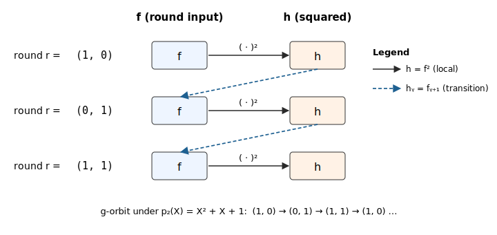

## 2. Local Rotation PIOP

This note documents the **local rotation PIOP** implemented in Ceno, used to
constrain two consecutive rounds of a round-based computation (e.g. the
Keccak-f permutation underlying SHA-3) inside a single GKR layer.

#### Why this PIOP exists

A round-based computation like Keccak-f passes state from round $r$ into
round $r+1$: a proof must enforce this hand-off for every consecutive pair.
The straightforward approach — **unroll each round into its own row** per
instance — scales linearly in $T$: $6$ witness polynomials and $6$ zero
constraints for the $T = 3$ squaring example below, $48$ and $48$ for Keccak.

The local rotation PIOP avoids that blow-up. Pack all $T$ rounds into
multilinear polynomials $f\_j(\mathbf{r}, \mathbf{i})$, with $\mathbf{r}$
indexing rounds along the $g$-orbit and $\mathbf{i}$ indexing instances.
Then "next round" on indices becomes $\mathbf{r} \mapsto g(\mathbf{r})$, and
each hand-off collapses to a single sumcheck-checkable constraint — one
commitment per witness, no duplication across rounds.

#### The local rotation constraint

Given round witnesses $f\_1, \ldots, f\_w$, write
$f\_j'(\mathbf{r}, \mathbf{i}) := f\_j\bigl(g(\mathbf{r}),\, \mathbf{i}\bigr)$
for the "next-round shift" of $f\_j$. The local rotation PIOP enforces a
per-instance algebraic relation linking adjacent rounds, of the form

$$
0 = C\bigl(f\_1(\mathbf{r}, \mathbf{i}), \ldots, f\_w(\mathbf{r}, \mathbf{i}); f\_1'(\mathbf{r}, \mathbf{i}), \ldots, f\_w'(\mathbf{r}, \mathbf{i})\bigr),
\qquad \forall \quad (\mathbf{r}, \mathbf{i}) \in B\_m \times B\_n \tag{1}
$$

where $C$ is a low-degree polynomial expressing the round-transition gate.

**Example.** Suppose each round takes an input, squares it, and feeds the
square into the next round. Let $f(\mathbf{r}, \mathbf{i})$ hold the round-$\mathbf{r}$
input and $h(\mathbf{r}, \mathbf{i})$ the squared intermediate. The
round-transition gate is then expressed by two constraints:

$$
0 = h(\mathbf{r}, \mathbf{i}) - f(\mathbf{r}, \mathbf{i})^2, \qquad
0 = h(\mathbf{r}, \mathbf{i}) - f\bigl(g(\mathbf{r}),\mathbf{i}\bigr). \tag{2}
$$

The first is a purely local algebraic relation at round $\mathbf{r}$. The
second is the actual **hand-off**: it says $h$ at round $\mathbf{r}$ equals
$f$ at the *next* round $g(\mathbf{r})$.

Pictorially, take the smallest non-trivial case: $m = 2$ with primitive
polynomial $p\_2(X) = X^2 + X + 1$. The $g$-orbit has length $2^2 - 1 = 3$
and cycles $(1, 0) \to (0, 1) \to (1, 1) \to (1, 0) \to \cdots$, so $T = 3$
rounds indexed by these three hypercube points. Solid arrows are the local
squaring constraint, dashed arrows are the transition from $h$ at round
$\mathbf{r}$ to $f$ at round $g(\mathbf{r})$:

  

#### Outline

The note is organised in three sections:

1. **The `next` function $g: B\_m \to B\_m$** — a bijection (permutation) with
   orbit of length $2^m - 1$ on the nonzero hypercube, borrowed from the
   HyperPlonk Lookup PIOP [[HyperPlonk §3.7]](#hyperplonk).
2. **Algebraic simplicity of $f \circ g$** — why composing a multilinear
   polynomial $f$ with $g$ does not blow up its degree, thanks to HyperPlonk's
   linearization trick.
3. **Local rotation PIOP** — how the per-round constraint above is
   enforced by a single selector-gated zerocheck over $B\_m \times B\_n$,
   reducing to two rotation-point openings of each $f\_j$.

### 1. The `next` function $g$

#### The key move: endow $B\_m$ with field structure

**As a bare set, the Boolean hypercube $B\_m = \\{0,1\\}^m$ carries no algebraic
structure** — bit-tuples cannot be "added" or "multiplied". To define a map
$g: B\_m \to B\_m$ with good properties (bijective, long orbit, low-degree
arithmetisation) we first *put* structure on $B\_m$ by identifying it with the
finite field $\mathbb{F}\_{2^m}$:

$$
\underbrace{B\_m}\_{\text{bare set}} \cong \underbrace{\mathbb{F}\_2^m}\_{\mathbb{F}\_2\text{-vector space}} \cong \underbrace{\mathbb{F}\_2[X]/(p\_m)}\_{\text{polynomial ring}} \cong \underbrace{\mathbb{F}\_{2^m}}\_{\text{field}}.
$$

Concretely:

1. **$B\_m \leftrightarrow \mathbb{F}\_2^m$** (as $\mathbb{F}\_2$-vector spaces):
   interpret a bit-tuple as a vector over $\mathbb{F}\_2 = \\{0, 1\\}$, with
   bitwise XOR as addition and componentwise scalar multiplication.
2. **$\mathbb{F}\_2^m \leftrightarrow \mathbb{F}\_2[X]/(p\_m)$** (as
   $\mathbb{F}\_2$-vector spaces): identify
   $\mathbf{b} = (b\_1, \ldots, b\_m) \mapsto f\_\mathbf{b}(X) := b\_1 + b\_2 X + \cdots + b\_m X^{m-1}$.
3. **$\mathbb{F}\_2[X]/(p\_m) \cong \mathbb{F}\_{2^m}$** (as fields): the
   quotient is a field iff $p\_m$ is irreducible; when moreover $p\_m$ is
   *primitive*, the element $X$ is a generator of the cyclic multiplicative
   group $\mathbb{F}\_{2^m}^\times$.

Once this identification is fixed, $B\_m$ inherits the full field structure of
$\mathbb{F}\_{2^m}$ — in particular a multiplication — and we can do arithmetic
on hypercube points.

#### Choosing a primitive polynomial

Fix a **primitive polynomial** $p\_m(X) \in \mathbb{F}\_2[X]$ of degree $m$:

$$
p\_m(X) = X^m + \sum\_{s \in S} X^s + 1, \qquad S \subseteq [m-1].
$$

Recall $p\_m$ is *primitive* iff it is irreducible and $X$ generates
$\mathbb{F}\_{2^m}^\times$ in the quotient field $\mathbb{F}\_2[X]/(p\_m)$.
Primitive polynomials of every degree exist (e.g. $p\_5 = X^5 + X^2 + 1$,
$p\_6 = X^6 + X + 1$). Under the identification
$B\_m \leftrightarrow \mathbb{F}\_{2^m}$, the origin $0^m \in B\_m$ is the field
zero, and $B\_m \setminus \\{0^m\\} \leftrightarrow \mathbb{F}\_{2^m}^\times$.

#### Defining $g$ via multiplication by $X$

Take $g: B\_m \to B\_m$ to be multiplication by $X$ in $\mathbb{F}\_{2^m}$:

$$
g(\mathbf{b}) := \text{coeff. vector of } X \cdot f\_\mathbf{b}(X) \bmod p\_m.
$$

By primitivity of $p\_m$, $g$ fixes $0^m$ and cycles $B\_m \setminus \\{0^m\\}$
with period $2^m - 1$.

#### A very simple algebraic formula

The punchline: although we invoked field theory to define $g$, the resulting
map has an elementary closed form. Writing
$\mathbf{b} = (b\_0, b\_1, \ldots, b\_{m-1})$,

$$
\boxed{g(b\_0, b\_1, \ldots, b\_{m-1}) = (b\_{m-1}, b\_0', b\_1',\ldots), \quad b\_i' = \begin{cases} b\_i \oplus b\_{m-1}, & i \in S, \\\\ b\_i, & i \notin S. \end{cases} } \tag{3}
$$

That is: **cyclically shift right by one position** (so $b\_{m-1}$ wraps around
to slot $0$), then **XOR $b\_{m-1}$ into every slot indexed by $S$**. The
wrap-around XOR is exactly what picking up the reduction $X^m \equiv
\sum\_{s \in S} X^s + 1 \pmod{p\_m}$ contributes. Each output coordinate is thus
the XOR of **at most two input bits** — a structural fact we exploit in
Section 2.

### 2. Algebraic simplicity of $f \circ g$

Having $g$ permute the hypercube is not enough — we need $f \circ g$ to be
representable as a low-degree polynomial for sumcheck-based PIOPs.

#### The obstruction

Although $g$ looks $\mathbb{F}\_2$-linear (cyclic shift + XOR), sumcheck does
not run over $\mathbb{F}\_2$: the prover evaluates polynomials at random points
$\mathbf{r}$ in an extension field $\mathbb{F}$, where each $r\_i$ is an
arbitrary field element. Extended to $\mathbb{F}$, the Boolean XOR has
multilinear extension $b \oplus b' \mapsto b + b' - 2 b b'$ — **quadratic**,
not linear. Naively substituting $\mathbf{x} \mapsto g(\mathbf{x})$ into a
multilinear $f$ therefore yields a polynomial of individual degree up to $2$,
and iterating $g$ compounds the blow-up. (This is why the HyperPlonk paper
calls $g$ a "quadratic generator".)

#### The linearization trick (HyperPlonk, Lemma 3.9)

Instead of forming $f(g(\mathbf{X}))$ symbolically, define

$$
f\_{\Delta\_m}(X\_1, \ldots, X\_m) := X\_m \cdot f\bigl(\underbrace{1,\, X\_1', \ldots, X\_{m-1}'}\_{\text{rotation point } \mathbf{p}\_1}\bigr) + (1 - X\_m) \cdot f\bigl(\underbrace{0,\, X\_1, \ldots, X\_{m-1}}\_{\text{rotation point } \mathbf{p}\_0}\bigr), \tag{4}
$$

where $X\_i' := 1 - X\_i$ if $i \in S$ and $X\_i' := X\_i$ otherwise.

**Lemma ([[HyperPlonk, Lemma 3.9]](#hyperplonk)).** For every polynomial
$f$ of individual degree $d$,

$$
f\_{\Delta\_m}(\mathbf{x}) = f(g(\mathbf{x})) \qquad \forall\, \mathbf{x} \in B\_m,
$$

and $f\_{\Delta\_m}$ still has individual degree $d$. Moreover
$f\_{\Delta\_m}(\mathbf{r})$ at any field point $\mathbf{r}$ is determined by
**two** evaluations of $f$.

**What this buys us.** If $f$ is multilinear ($d = 1$), so is
$f\_{\Delta\_m}$. The map $f \mapsto f\_{\Delta\_m}$ is the algebraic stand-in
for $f \circ g$ inside a sumcheck: it preserves individual degree, and the
verifier can turn a claim about $f\_{\Delta\_m}(\mathbf{r})$ into two claims
about $f$ at the two **rotation points** $\mathbf{p}\_0, \mathbf{p}\_1$
highlighted in (4) — used in Section 3.

### 3. Local rotation PIOP

Fix $m$ so the number of rounds $T$ fits in one $g$-orbit
($T \leq 2^m - 1$) and let $n$ index $2^n$ instances, so each witness is a
multilinear polynomial $f\_j: B\_m \times B\_n \to \mathbb{F}$. Because $g$ fixes $0^m$
and cycles the remaining $2^m - 1$ points, the constraint must be enforced
only on the $T$ points of $B\_m$ representing real rounds. Introduce a
precomputed **rotation selector** $\mathrm{sel}$ that
vanishes off of those $T$ rounds on the $\mathbf{r}$-coordinate. The
constraint is checked by a standard zerocheck: the verifier samples a
random challenge $(\mathbf{z}\_r, \mathbf{z}\_i) \in \mathbb{F}^m \times \mathbb{F}^n$
and runs sumcheck on

$$
0 = \sum\_{(\mathbf{r}, \mathbf{i}) \in B\_m \times B\_n} \mathrm{sel}\_{\mathbf{z}\_r, \mathbf{z}\_i}(\mathbf{r}, \mathbf{i}) \cdot C\bigl(f\_1(\mathbf{r}, \mathbf{i}), \ldots, f\_w(\mathbf{r}, \mathbf{i}), f\_1'(\mathbf{r}, \mathbf{i}), \ldots, f\_w'(\mathbf{r}, \mathbf{i})\bigr), \tag{5}
$$

where $\mathrm{sel}\_{\mathbf{z}\_r, \mathbf{z}\_i}(\mathbf{r}, \mathbf{i}) := \mathrm{eq}\bigl((\mathbf{z}\_r, \mathbf{z}\_i), (\mathbf{r}, \mathbf{i})\bigr) \cdot \mathrm{sel}(\mathbf{r}, \mathbf{i})$
is the challenge-parametrised selector.

The sumcheck itself draws fresh random challenges $(\mathbf{s}\_r, \mathbf{s}\_i) \in \mathbb{F}^m \times \mathbb{F}^n$
round by round and reduces (5) to claimed evaluations of the $f\_j$ and
$f\_j'$ at this post-sumcheck point:

$$
f\_j(\mathbf{s}\_r, \mathbf{s}\_i) \quad \text{and} \quad f\_j'(\mathbf{s}\_r, \mathbf{s}\_i) \qquad j = 1, \ldots, w.
$$

The first batch is opened directly against the committed $f\_j$. For the
second, Section 2 delivers the key reduction: since $f\_j' = f\_j \circ g$
(with $g$ acting on the $\mathbf{r}$-coordinate only), the linearization
lemma tells us that $f\_j'(\mathbf{s}\_r, \mathbf{s}\_i)$ is determined by
evaluating $f\_j$ at the two **rotation points** $\mathbf{p}\_0, \mathbf{p}\_1$
of (4) — specialised to $\mathbf{X} = \mathbf{s}\_r$ — each paired with the
same $\mathbf{s}\_i$. No separate commitment to $f\_j'$ is needed.

In total, the PIOP needs to open each committed witness $f\_j$ at exactly
**three** points:

$$
\boxed{(\mathbf{s}\_r, \mathbf{s}\_i), \qquad (\mathbf{p}\_0, \mathbf{s}\_i), \qquad (\mathbf{p}\_1, \mathbf{s}\_i)} \tag{6}
$$

— the post-sumcheck point itself, plus the two rotation points induced by
$\mathbf{s}\_r$ via (4).

### References

-  Chen, Bünz, Boneh, Zhang. *HyperPlonk: Plonk with Linear-Time Prover and High-Degree Custom Gates*, §3.7 (Lookup PIOP), Lemma 3.8 (permutation property), and Lemma 3.9 (linearization). 2023.
  Available at: <https://eprint.iacr.org/2022/1355.pdf>
- Lidl & Niederreiter, *Introduction to Finite Fields and Their Applications*, chapters on irreducible and primitive polynomials and the cyclic structure of $\mathbb{F}\_{q^n}^\times$.
