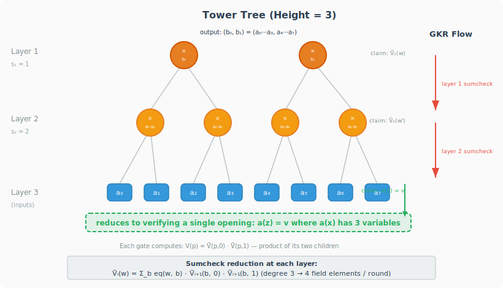

## 1. GKR Protocol for Grand Product

In Ceno, grand product checks (used for offline memory checking, permutation arguments, etc.)
require computing a product of the form $\prod\_{i} a\_i$. We use a **complete binary tree of
multiplication gates** — called a **tower tree** — and verify its computation via the
[GKR protocol](https://people.cs.georgetown.edu/jthaler/GKRNote.pdf), following the approach of
[[Thaler13, Section 5.3.1]](#thaler13).

### The Tree Structure

A tower tree of height $d$ takes $n = 2^d$ inputs and produces a 2-tuple output. The tree
has $d$ layers:

- **Layer $d$** (bottom): the $n$ input values $a\_0, a\_1, \ldots, a\_{n-1}$.
- **Layer $i$** ($1 < i < d$): each gate $p$ multiplies its two children at layer $i+1$.
- **Layer 1** (top): two gates outputting $(b\_0, b\_1)$ where
  $b\_0 = \prod\_{i=0}^{n/2-1} a\_i$ and $b\_1 = \prod\_{i=n/2}^{n-1} a\_i$.

The wiring is natural: gate $p$ at layer $i$ has left child $(p, 0)$ and right child
$(p, 1)$ at layer $i+1$. Equivalently, the children of gate $p$ are gates $2p$ and
$2p+1$. Every gate computes:

$$
V\_i(p) = \tilde{V}\_{i+1}(p, 0) \cdot \tilde{V}\_{i+1}(p, 1)
$$

The following diagram shows a height-3 tower tree with 8 inputs, outputting
$(b\_0, b\_1) = (a\_0 \cdots a\_3,\; a\_4 \cdots a\_7)$:

  

### Applying the GKR Protocol

The GKR protocol verifies the computation layer by layer, from the top down to the inputs.
At each layer, the verifier holds a claim about the multilinear extension $\tilde{V}\_i(w)$
for some random point $w$, and reduces it to a claim about $\tilde{V}\_{i+1}(\omega)$ via
a sumcheck invocation.

**Claim reduction at each layer.** Suppose the verifier holds a claim
$\tilde{V}\_i(w) = c$ for some random point $w$. Since every gate at layer $i$
multiplies its two children at layer $i+1$, the multilinear extension satisfies:

$$
\tilde{V}\_i(w) = \sum\_{b \in \\{0,1\\}^{s\_i}} \textrm{eq}(w, b) \cdot \tilde{V}\_{i+1}(b, 0) \cdot \tilde{V}\_{i+1}(b, 1)
$$

where $\tilde{V}\_i$ and $\tilde{V}\_{i+1}$ are the multilinear extensions of the gate values
at layers $i$ and $i+1$ respectively, and
$\textrm{eq}(w, b) = \prod\_{k=1}^{s\_i}(w\_k b\_k + (1 - w\_k)(1 - b\_k))$ is the multilinear
extension of the equality function (equals 1 when $b = w$ on Boolean inputs).

The verifier reduces this claim by running the **sumcheck protocol** on the right-hand side. The
summand $\textrm{eq}(w, b) \cdot \tilde{V}\_{i+1}(b, 0) \cdot \tilde{V}\_{i+1}(b, 1)$
has **degree 3** in each variable of $b$ (one degree from $\textrm{eq}$, one from each
$\tilde{V}\_{i+1}$ factor). Therefore, each round of the sumcheck protocol requires the prover
to send **4 field elements**.

**Full protocol flow (height-3 example):**

1. **Start:** The verifier has the claimed output $(b\_0, b\_1)$ and constructs a claim
   $\tilde{V}\_1(w) = c$ at a random point $w$.
2. **Layer 1 sumcheck:** Run sumcheck on
   $\sum\_{b} \textrm{eq}(w, b) \cdot \tilde{V}\_2(b, 0) \cdot \tilde{V}\_2(b, 1)$.
   This reduces the claim to evaluations of $\tilde{V}\_2$, which the verifier combines into a
   single claim $\tilde{V}\_2(w') = c'$ at a new random point $w'$.
3. **Layer 2 sumcheck:** Run sumcheck on
   $\sum\_{b} \textrm{eq}(w', b) \cdot \tilde{V}\_3(b, 0) \cdot \tilde{V}\_3(b, 1)$.
   This reduces to a claim about $\tilde{V}\_3$, i.e., an evaluation of the input multilinear
   polynomial $a(x)$ (with 3 variables) at a point $z$. The validity of $(b\_0, b\_1)$
   is thus reduced to verifying a single evaluation/opening $a(z) = v$.

### Tower trees in Ceno
In Ceno, tower trees are the backbone of **offline memory checking**: every memory read/write is verified by computing a grand product via a tower tree, and the GKR protocol proves this computation correct with a linear-time prover and a logarithmic-time verifier. 

### References

-  Justin Thaler. *Time-Optimal Interactive Proofs for Circuit Evaluation*. 2013.
  Section 5.3.1: "The Polynomial for a Binary Tree".
  Available at: <https://eprint.iacr.org/2013/351.pdf>
