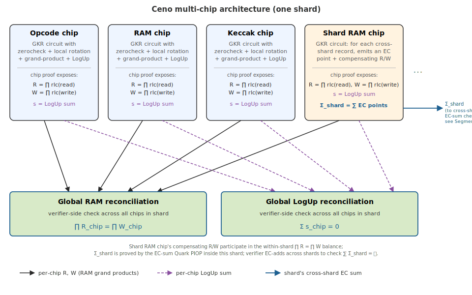
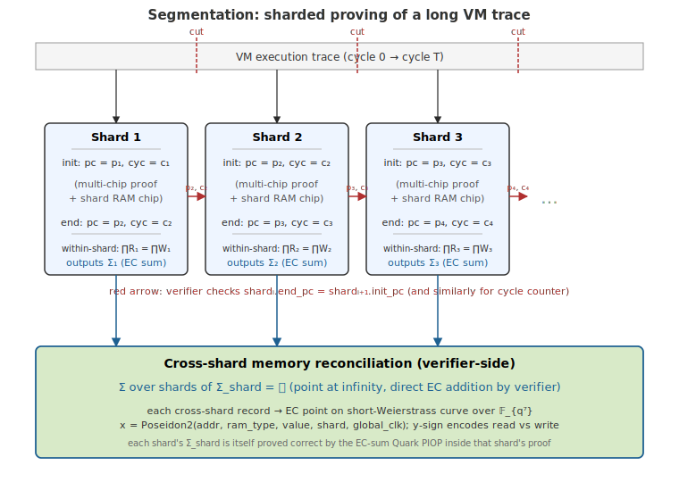

# Architecture Overview

## 1. Multi-chip Architecture

Ceno is structured as a collection of **chips**, each a self-contained
GKR circuit. A chip's per-layer constraints are **same-row gates**:
every gate is a low-degree polynomial identity among witness values at
the *same* hypercube index, checked by a per-layer zerocheck. Ceno
has **no global row-rotation**; multi-step computations are expressed
in one of two ways:

- **Unroll into a single row** — stage every intermediate value as its
  own same-row witness. Works when the step count is small enough to
  fit as extra columns.
- **[Local rotation PIOP](./appendix/local-rotation-piop.md)** — the
  only cross-row mechanism. It links round $\mathbf{r}$ to round
  $g(\mathbf{r})$ along a $g$-orbit on $B_m$ (the "next" function
  from HyperPlonk). Used for round-based computations such as
  Keccak-f, where unrolling every round into a single row would be
  prohibitive.

Chips do not share witnesses directly — they interact through two
mechanisms that are both reconciled by a single global LogUp tower.

  

**1. Shared RAM state (`RAMType`).** Three logical address spaces are
exposed to every chip:

- `GlobalState` — VM-wide state such as program counter and cycle
  counter.
- `Register` — RISC-V registers.
- `Memory` — main memory.

Each access is hashed to an extension-field element by random linear
combination (RLC) with the `RAMType` tag folded into the hash, so
entries from different regions cannot collide. Each chip's GKR
circuit **locally accumulates** these hashes into a grand product
for reads and a grand product for writes:

$$
R = \prod\_i \mathsf{rlc}(r\_i), \qquad W = \prod\_j \mathsf{rlc}(w\_j),
$$

and outputs both as part of the chip proof.

**2. Cross-chip lookups.** A chip that advertises a ROM-style table
(e.g. the range check chip) can be
queried by other chips. Each chip's GKR circuit likewise
**locally accumulates** its lookup contributions — tables it
exposes and queries it issues — into a single fractional LogUp sum
and outputs it as part of the chip proof.

**Reconciliation.** Two parallel mechanisms combine the per-chip
outputs:

- **Shared RAM state** — the verifier checks that the product of every
  chip's $R$ equals the product of every chip's $W$. Each chip's
  $R$ and $W$ are themselves proved correct by the
  [GKR grand-product PIOP](./appendix/tower_tree.md) run inside that
  chip's proof.
- **Cross-chip lookups** — the verifier checks that the per-chip
  LogUp fractional sums add up to zero across all chips. Each chip's
  LogUp sum is itself proved correct by the **GKR LogUp PIOP** run
  inside that chip's proof.

Both PIOPs run *per-chip*, inside each chip's GKR proof, to establish
that chip's $R$, $W$, and LogUp sum. The global reconciliation is
just a small verifier-side check on the per-chip outputs: $\prod R = \prod W$
across chips for RAM, and the sum of LogUp fractional sums across
chips is zero for cross-chip lookups.

The main benefit of this split is **prover peak memory**: chips can
be proved one at a time (or in small batches), so peak memory is
bounded by the largest chip's witness rather than the sum over all
chips. Proving every chip simultaneously would hold every witness in memory at once.

One chip in the diagram — the **shard RAM chip** — is special: it
participates in the within-shard $\prod R = \prod W$ balance like
any other chip, but additionally emits a cross-shard EC accumulator
$\Sigma_{\text{shard}}$ that is reconciled across shards rather
than inside the shard. Its role is explained in the Segmentation
section below.

## 2. Segmentation

When a VM's execution trace is too large to fit in a single shard, we
split it along the cycle axis into multiple shards, each proved
independently. The proof system must then check that the shards
compose into a single consistent execution:

  

- **Control-flow continuity.** Each shard exposes its initial and
  final `GlobalState` (program counter, cycle counter, ...) as public
  inputs, and the verifier checks
  $\text{shard}_i.\text{end\_pc} = \text{shard}_{i+1}.\text{init\_pc}$
  (and likewise for other `GlobalState` fields) at every shard
  boundary.
- **Dynamic heap/hint continuity.** Shards also expose the start
  address and length of the dynamic heap and hint init regions. The
  verifier checks that these segments stay within the platform's heap
  and hint windows and that each shard starts exactly where the
  previous shard ended, so dynamic init data cannot skip, overlap, or
  move out of range across shard boundaries. See
  [Memory Continuation Checks](./memory-continuation-checks.md).
- **Cross-shard memory consistency.** Memory written in shard $i$
  must remain readable in any later shard $j > i$. The within-shard
  RAM grand product $\prod R = \prod W$ cannot be reused across
  shards because each shard's RLC challenge is sampled from its own
  Fiat-Shamir transcript, so per-shard products live in different
  random-hash scalings and cannot be combined.

  The underlying idea is a **homomorphic multiset digest**: a map
  $H$ from multisets of memory records into an abelian group
  $(G, +)$ that is a monoid homomorphism —
  $H(S_1 \uplus S_2) = H(S_1) + H(S_2)$ and $H(\emptyset) = 0$
  (the group identity). Homomorphism is what lets a global digest
  be assembled from per-shard digests by simple group addition,
  with no shared challenge. If $H$ is chosen so that a matched
  (write, later-read) pair digests to $0$, every matched pair
  cancels, and consistency across shards reduces to checking that
  the digest of the full cross-shard multiset equals $0$ — i.e. the
  digest of the empty multiset.

  The standard recipe is to pick a per-record hash
  $h : \text{records} \to G$ and define
  $H(S) := \sum_{r \in S} h(r)$; homomorphism is then automatic.
  Ceno takes $G$ to be a short-Weierstrass curve $E$ over the
  septic extension $\mathbb{F}\_{q^7}$, with $h$ a deterministic
  hash-to-curve: the $x$-coordinate is a Poseidon2 hash of
  $(\text{addr}, \text{ram\_type}, \text{value}, \text{shard}, \text{global\_clk})$,
  and the sign of $y$ encodes read vs write (writes take
  $y \in [p/2, p)$, reads take $y \in [0, p/2)$). A write and its
  matching future read hash to the same $x$ with opposite $y$, so
  they are additive inverses on $E$ and cancel under EC addition.
  Soundness rests on collision-resistance of Poseidon2 in the
  $x$-coordinate — two unrelated records shouldn't accidentally
  hash to $\pm$ the same point. This EC-based cross-shard
  multiset-hash design is adapted from
  [SP1](https://github.com/succinctlabs/sp1), which introduced it
  for cross-shard memory consistency in its zkVM.

  A dedicated **shard RAM chip** inside each shard's proof ties
  the two layers together: for every memory read whose matching
  write lives in an earlier shard, it inserts a compensating local
  write (so the local RLC grand product still balances) and emits
  the corresponding EC point into the shard's cross-shard
  accumulator $\Sigma_{\text{shard}}$; symmetrically for writes that
  will be read in a later shard. The
  [EC-sum Quark PIOP](./appendix/ec-sum-quark.md) runs *inside*
  each shard's proof to establish that $\Sigma_{\text{shard}}$
  equals the sum of those per-record EC points. The verifier then
  just EC-adds the per-shard $\Sigma_{\text{shard}}$ values and
  checks
  $\sum_{\text{shard}} \Sigma_{\text{shard}} = \mathcal{O}$
  (the point at infinity) directly. The number of shards is at most
  in the hundreds, so this is a few hundred EC additions.
